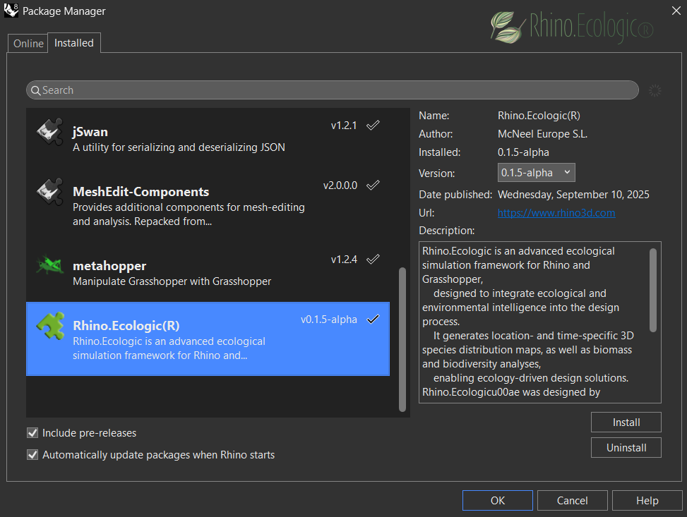
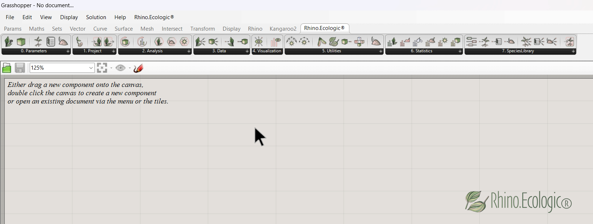
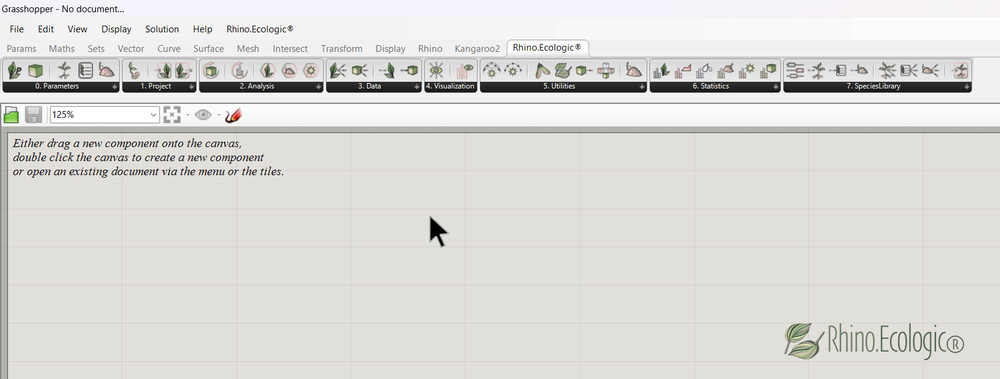

# Installation guide for *RHINO.ECOLOGIC®*    

**Version**: 0.1.7 alpha  
**Compatible with**: Rhino 8+, Grasshopper  
**Platform**: Windows  
**Release date**: xx 2025  
**Draft**: Verena Vogler

*Rhino.Ecologic®* is an **advanced ecological simulation framework** for Rhino and Grasshopper, designed to seamlessly integrate ecological and environmental knowledge into the architectural and design process. It enables users to model and ecologically analyze architectural projects. Outputs include location- and time-specific 3D species distribution maps, as well as biomass and biodiversity simulations.

This page provides installation guidelines for the Rhino.Ecologic framework. 

## System requirements

**Processor:** A 64-bit Intel or AMD processor  
**RAM:** 8 GB of RAM is the minimum, but 16 GB or more is recommended for larger models and smoother performance.  
**Operating System:** Windows 11, or 10  
**Graphics Card:** OpenGL 4.1 capable video card with 4 GB of video RAM  
**Storage:** 600 MB   
**Rhino Version:** Rhino 8 + https://www.rhino3d.com/download/ 
**Grasshopper:** pre-installed with Rhino 
**.NET Framework:** 4.8 or later 
**Internet:** Required for license activation and updates 
 

---
## Step 1: Download the plugin

Download the latest version of *Rhino.Ecologic®* from the official website, the project repository (YAK file) or the  <code>_PackageManager</code>:

📦 `rhino.ecologic(r)-0.1.7-alpha-rh8_8-any.yak`
currently here: https://drive.google.com/drive/folders/1UQag6aRlAhbvV7UQ6EGf8YgF-_a5jnW0
   
In the next step, drag and drop it into Rhino. Rhino.Ecologic (alpha) will install automatically.
In Rhino, type `_PackageManager` into the command line to open the **Rhino Package Manager**. 
Confirm that Rhino.Ecologic is listed and properly installed.   
  

 
   
*Rhino.Ecologic® in the Rhino Package Manager.*
 

Restart Rhino & Grasshopper to complete installation. The installation files should install automatically in the following repository: 

`C:\Users\<UserName>\AppData\Roaming\Grasshopper\Libraries\Rhino.Ecologic\<version>`

---
## Step 2: Activate toolbar

Launch <strong>Grasshopper</strong> and new tab called *"Rhino.Ecologic®"* will appear in the Grasshopper ribbon.

   
*Loaded Rhino.Ecologic® toolbar in Grasshopper.*
 

##  Step 3: Verify installation

To check whether everything works drag one Rhino.Ecologic Grasshopper component (e.g., `Run Ecological Analysis`) onto the Grasshopper canvas.

    
*The `Run Ecological Analysis` Grasshopper component loads correctly. You should see tooltips and icons correctly rendered.*
 

Test basic connectivity with the example model provided in `/examples` folder: https://drive.google.com/drive/folders/1-BJFjhQ7BCHT9mP9yyBOuZhKPZ1J2fXm)

---
## Troubleshooting

Common warnings/errors + fixes.

| **Issue**              | **Solution**                                                                 |
|------------------------|------------------------------------------------------------------------------|
| Toolbar does not appear | Ensure `.gha` file is unblocked (Right-click → Properties → check “Unblock”) |
| Errors on load          | Update Rhino to the latest stable version and restart your system            |
|Error message DLL NOT FOUND         | ENSURE BOTH DLLS ARE PRESENT: BiophiliaAPI.dll and plants.dll must be in the same directory; Your application executable should be in the same directory.     CHECK FILE PROPERTIES: Right-click each DLL -> Properties -> Unblock (if present); Ensure both DLLs have the same architecture (both 32-bit or both 64-bit)     IF PROBLEM PERSISTS: 1. Run this application as Administrator; 2. Temporarily disable antivirus software; 3. Check Windows Event Viewer for additional error details; 4.Copy runtime DLLs to application directory as last resort

---
## Example files

Located in the `/examples` directory: https://drive.google.com/drive/folders/1-BJFjhQ7BCHT9mP9yyBOuZhKPZ1J2fXm

- Example GH files (`.gh`)
- Example Rhino file
- Example custom plant libraries (.json files)

---
### Help and feedback

If you encounter any issues or have questions, feel free to reach out. Please share your feedback, bug reports, or feature requests using this short form:  
   [Submit Feedback](https://docs.google.com/forms/d/e/1FAIpQLScrWsFKbOuNfe3xqFSj6IBbicJy6n7YHwASiWTutuiII5RmzA/viewform?usp=pp_url)

---
#### Referencing

When referring to Rhino.Ecologic® in a scientific publication, cite as follows:

**Vogler, V., Kourkopoulos, E., Fraguada, L., Mimet, A., & Joschinski, J. (2025).** Integrating ecological modeling into the 3D CAD system Rhinoceros. *JoDLA – Journal of Digital Landscape Architecture, Issue 10–2025*, 86–100. Berlin/Offenbach: Wichmann Verlag im VDE VERLAG. e-ISSN 2511-624X. https://doi.org/10.14627/537754009

**Vogler, V., Kourkopoulos, E., Joschinski, J., & Eckelt, K. (2025).** Developing volumetric data models for ML training datasets using Grasshopper. *JoDLA – Journal of Digital Landscape Architecture*, Issue 10–2025, 101–113. Berlin/Offenbach: Wichmann Verlag im VDE VERLAG. e-ISSN 2511-624X. https://doi.org/10.14627/537754010

---

 
 
 

Have fun using Rhino.Ecologic!

*Eleftherios, Jens, and Verena.*
 

 
 
 &copy; 2025 McNeel Europe S.L. All rights reserved.
 
