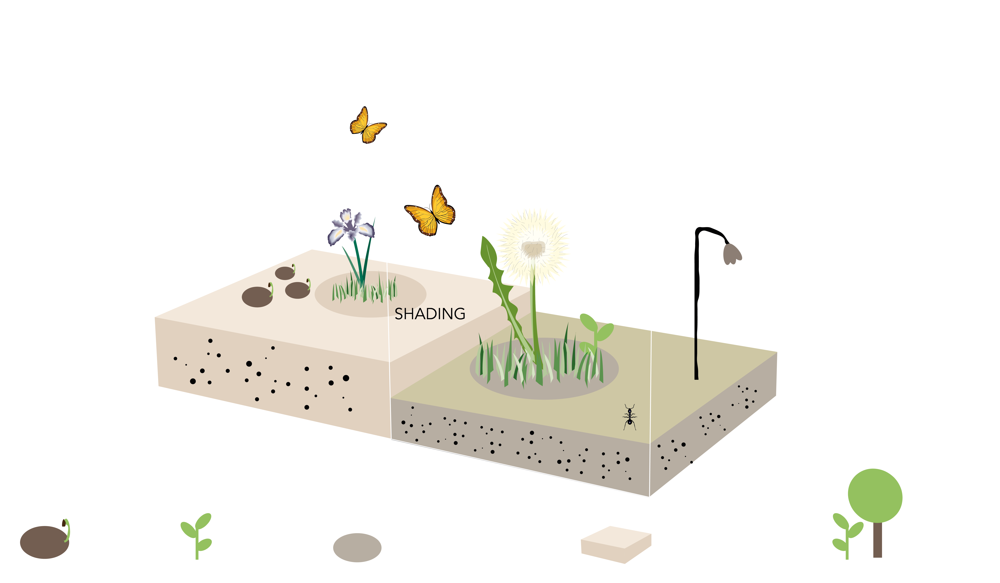

# Guide on the *Joschinski Model* —an individual-based community model

**Version**: 1.2.9
**Compatible with**: *RHINO.ECOLOGIC®* for Rhino 8+  
**Platform**: Windows  
**Release date**: xx 2025  
**Draft**: Jens

Rhino.Ecologic.PlantModel simulates the presence and change of plant communities over time. It models key ecological processes and tracks the biomass and number of plant individuals from multiple species.

## Introduction  
Ecological processes are complex. Plants require various resources to grow (e.g. light, water, nutrients); the environment must meet certain conditions (e.g. pH, temperature range); and plants interact with each other (e.g. competition for light) and with other organisms (e.g. root mycorrhiza). Moreover, the biotic and abiotic factors interact with each other in complex ways. For example, warm temperature increases evaporation rates of trees and thus may reduce available water for shallow-rooting grasses - the water stress may then reduce defenses against herbivores. For these reasons, predicting ecological community dynamics requires substantial analytical or modelling efforts.  
A common class of modelling tools are agent-based simulations, also called individual-based models in ecology. These models simulate the life of individual organisms and their interactions with each other and with the environment, including stochastic processes. As with other complex adaptive systems, the outcome of ABMs is more than the sum of its parts, and results could not be guessed from the simple individual-level rules. While states or locations of individuals are meaningless on their own, ABM's provide higher-level insights into the system.  
In Rhino.Ecologic, we apply an individual-based model to simulate plant community dynamics. The model simulates the life of individuals from multiple species and provides information about the spataial distribution of species, as well as their temporal succession.  

>[!NOTE] 
>The model is stochastic. 

## 1 Aims and Capabilities  
The plant model of Rhino.Ecologic is an agent-based model that simulates individual plants. It applies key ecological processes such as growth, competition for light, reproduction, seed dispersal and death, and tracks the states of the plants throughout. As outcome it reports the change in biomass, plant volume and plant numbers (species-specific), relative changes in species prevalence (community composition) over time, and their spatial patterning.  
  
## 2 Scale  
The model is flexible regarding input scale and resolution, but performs best for sites that lie between 100 and 10000 m² (small house to university campus). It models the change of the plant community over time, applying annual time steps for approximately 10-20 years. It can be used to understand establishment of communities and successional dynamics, but not events at shorter (weather, seasonality) or longer time scales (climate change, evolution). 
The spatial resolution is by default 1 m³, but coarser resolutions can also be used for larger sites. Internally the model applies a finer resolution for shade calculations (5 cm in z-direction), but this information is not meant for interpretation purposes and not provided via the Grasshopper interface.

> [!CAUTION]
> Do not change the resolution yet, work in progress

## 3 Processes and main concepts  

 

 
 
 

The model makes use of the environmental data that is provided by Rhino.Ecologic.Grasshopper (via Rhino.Ecologic.Core and Rhino.Ecologic.API). Accordingly, the main processes that the model simulates are:   
  
- 3-dimensional plant growth
- competition for light
- suitability of the soil, including soil type and soil depth

 Other important processes such as nutrient limitation, drought, herbivory and management are not included (yet).

## 4 Core logic and theory  
This section summarises the concepts of the model on a high level only. For details see \[**insert link to ODD**\]
### 4.1 Plant individuals  
The principle agent is an individual plant. The plant has two life stages: a seed stage and the actual plant individual. 

The individual has the following attributes:
- it **lives**: it grows, reproduces and dies.
- it is **photoautotrophic**: it converts light into a (carbohydrate) resource; it lives from these resources and produces green (photosynthetically active) biomass and seeds.
- it has a **shape**: it has a geometric representation, being able to e.g. cast a shade with its biomass. Plants can be cylinders, cones or ellipsoids, optionally resting on an (invisible) stem.
- it needs a **place** to live: the soil determines whether a plant can grow at all (habitat is suitable). Soil (space) is a limiting resource.
- it interacts with **the environment**: Stressors can affect each of the above properties, i.e. cause mortality, deplete resources or affect the soil.

The seeds have the following attributes:
- they **live**: they can die, or they can be converted into individuals
- they can form **seed banks**: Seeds produced in autumn may germinate the next year, or they can stay dormant and be buried in the soil for many years. The mortality of dormant seeds is lower than the mortality of active seeds that attempt to germinate (germination rate)
- they need **space**: the soil can accomodate a potentially large, but not infinite number of seeds. 

The attributes are naturally interdependent. Yet, in the model the interdependencies are kept to a minimum, both to constrain the logical complexity of the model, and to keep the model modular and modifiable. The following interdependencies exist:  
- plants only germinate on suitable soil types; they stop collecting resources if the soil becomes unsuitable, i.e. when roots exceed the soil depth;
- plants that run out of resources die;
- seed production (fecundity) only starts at maturity age, and requires resources.
- the general shape of the plant and its growth affect where green biomass is placed. This determines how much it shades others, and how much it is being shaded. Shading in turn affects resource acquisition.

In summary, the model simulates germination and seed dispersal, growth, resource allocation, shading, soil suitability and ~environmental stress~ \[not yet\].

### 4.2. Light 
Plants must be hit by light to collect energy resources. The amount of intercepted light depends on 1) the amount of solar energy hitting each voxel \[**link to Rhino.Grasshopper here**], and 2) the amount of light that is intercepted by other plants or plant parts. For simplicitly, the model currently calculates the plant material growing above each target voxel and reduces the solar energy proportionately (often by 100%). Future iterations of the model will incorporate angular or diffuse light as well. 

>[!WARNING]
>Trees and other larger plants will often block any incoming light for the plants growing below. We are working on a solution.

## 5. Typical life of a plant in the model  
1) The life of a plant starts as a seed. The seed may have been produced by another plant in previous year(s), or might have randomly dropped from elsewhere outside the modelled site ("seed rain"). If the seed is non-dormant and lands on suitable soil, and there is enough space left, there is a good chance that it germinates.  
2) Once germinated, the plant grows with a fixed growth trajectory (fig. x). The growth trajectory is determined by its lifespan and an inflection point at which growth slows down. The inflection point is also the point where the plant becomes mature and can produce its own seeds. Different growth forms (e.g. grasses or trees) have different presets for maturation time to ensure reasonable growth patterns. Shade-tolerant plants are generally slower growers.    
3) As the plant grows, 3D leaf volume is placed in voxels, and depending on shape the plant assumes a conical/spherical/cylindrical bounding box. The leaves can intercept sunlight and use the resources for growth, production of seeds (if mature) and general maintenance. Resource acquisition stops though if the plant roots become too deep for the soil in which it roots.
4) As long as the plant is not growing in shade, or shaded by larger plants, the plant should have enough resources to survive, grow further, and produce seeds. If the plant gets severely shaded, its bounding box continues to grow, but the leaf material within that bounding box may no longer keep up with the growth. As a result, the plant is less dense, cannot collect enough resources, falls further behind and eventually dies. Sometimes the shade is not persistent  and the plant can recover though: 1) when a larger plant dies or when the lower plant grows faster than the larger one, it can continue collecting resources; 2) when shading is caused by a built structure (e.g. small wall), the plant may also outgrow it before its resources are used up; 3) when two plants overlap within a voxel (layer), a random leaf lies on top and gets the light; in the next year, our focal plant may get the upper hand again.   
5) Different plant species vary in growth rates, shade tolerance, seed production and other traits. At some point, our focal plant may be outgrown by some plant that is more competitive or more shade tolerant, or simply more lucky. If not, it will at some point reach the end of its lifespan and die. 

## 6 Creating custom plant libraries
With approx. 300,000 plant species worldwide, it is impossible to parametrize the model for every possible scenario. Rhino.Ecologic ships hence with a default set of common european plant species \[currently not many, to be extended\]. These species can be interpreted as main representants of a more general type of plants with similar ecological characteristics (functional types/functional groups). For example, "Holcus lanatus" represents fast-growing and rather large, not very shade-tolerant grasses. Nevertheless, some distinct plant shapes or groups are not included in the default plant library (e.g. elephant grass, palms or cacti). We thus provide tools to create your own custom plant definitions. 

### 6.1 Description of the custom plant library tool
To ease the use of the library tool, we limited the number of absolutely required information to the bare minimum: 
- plant height in cm  
- diameter of the plant (stem diameter for shrubs and trees)
- crown diameter (for shrubs and trees only)
- life span in years
- growth form, i.e. grass, herb, shrub, deciduous or evergreen tree
- shade tolerance: low, medium or high
- soil tolerances

The information is mostly readily available online (e.g. Wikipedia) or can be estimated. With this information one can make educated guesses of remaining required inputs (use the `compute Presets` component, fine-tune the results if needed). The result is a definition of the plant in layman's terms. The `Plant` component now imputes the actual ecological and physiological traits that are used by the model. These include, among others, allocation strategy, photosynthetic efficiency and a volume-to-biomass conversion ratio. The raw traits are on purpose hidden from the UI, because they can be easily misinterpreted, causing physiologically or ecologically implausible plant definitions and wrong results. They can be viewed (read-only) by using the `Deconstruct Plant` component, and the underlying assumptions can be found in the detailed model description [link model_description].

### Glossary

### References

<small> Joschinski J., Boulangeat I., Calbi M., Hauck T.E, Vogler V., Mimet A. (2024). The Ecolopes Plant Model: a high-resolution model to simulate plant community dynamics in cities and other human-dominated and managed environments. bioRxiv 2024.09.23.614561.

 
 
 
Parts of this research and the development of Rhino.Ecologic® were supported by the European Commission under Horizon 2020 EXCELLENT SCIENCE – Future and Emerging Technologies (FET), Grant Agreement ID: 964414 (2021–2025).

