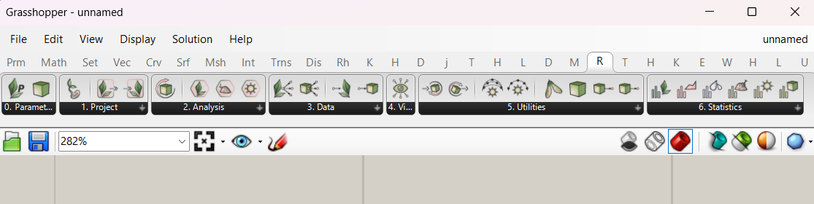
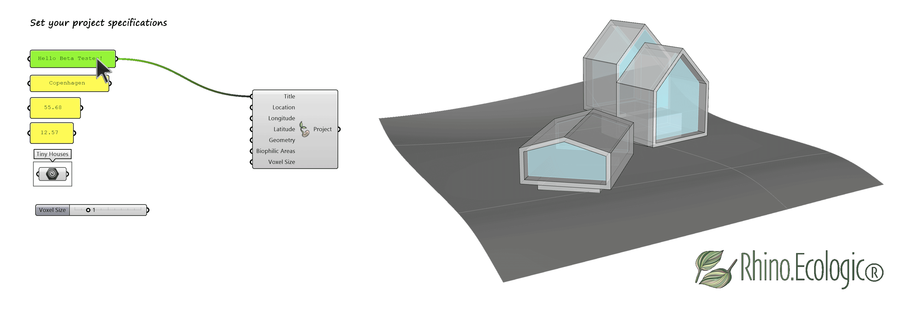
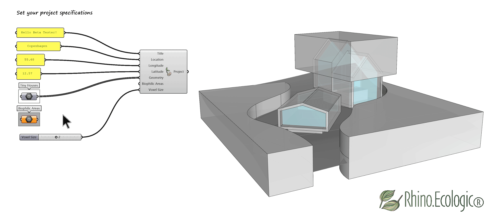
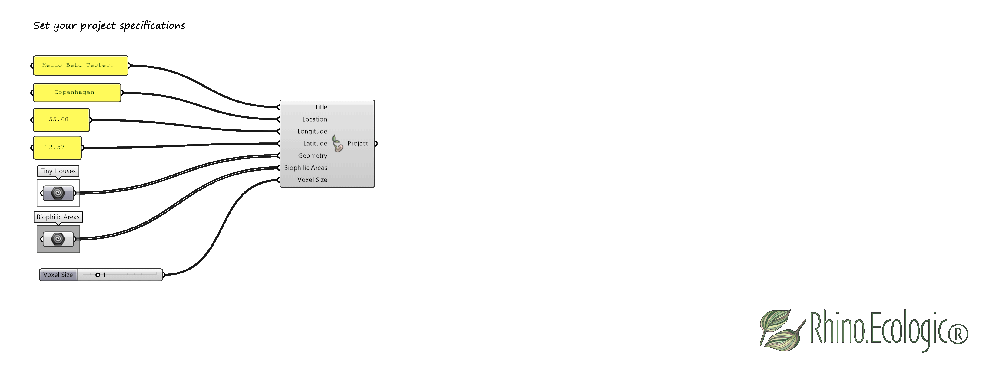
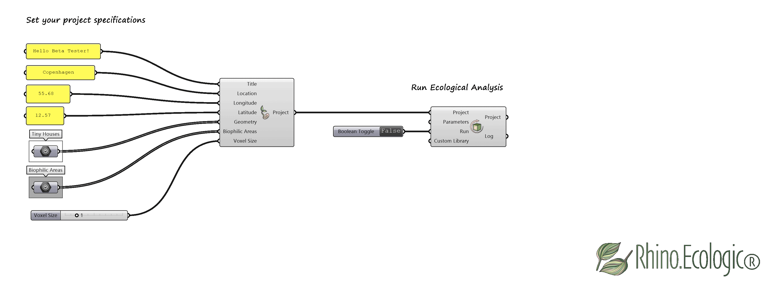
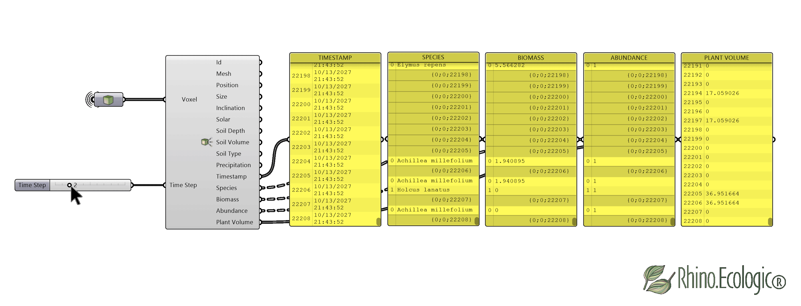
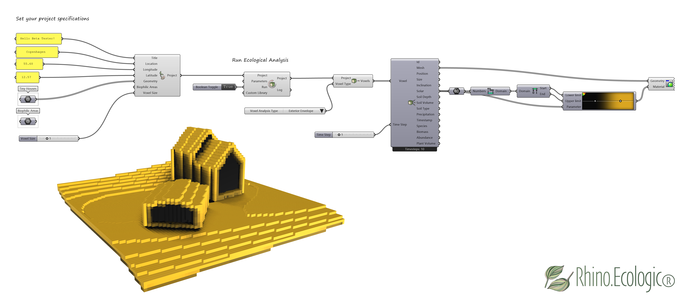
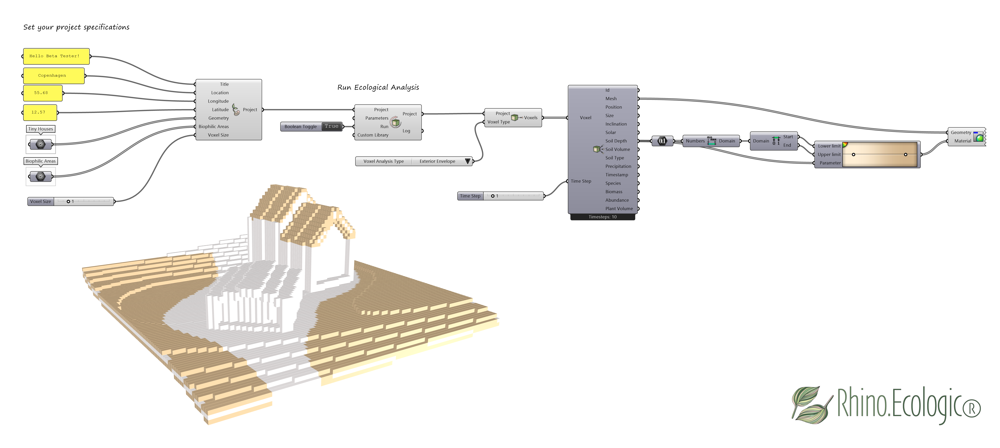

# Quick-start guide for *Rhino.Ecologic®*    

**Version**: 0.1.7 alpha  
**Compatible with**: Rhino 8+, Grasshopper  
**Platform**: Windows  
**Release date**: xx 2026  
**Draft**: Verena Vogler

*Rhino.Ecologic®* is an advanced ecological simulation framework for Rhino and Grasshopper, designed to seamlessly integrate ecological and environmental knowledge into the architectural and design process. It enables users to model and ecologically analyze architectural projects. Outputs include location- and time-specific 3D species distribution maps, as well as biomass and biodiversity simulations.

This page provides quick start guidelines for the *Rhino.Ecologic* framework. 

---

## Step 1: Launch Rhino & Grasshopper
1. Open **Rhino 8**. 

2. Go to **File > Open** in Rhino. 

3. Open one of the sample `.3dm` files located in the `/examples` directory. The file is named *“Rhino.Ecologic_Example_File.3dm”* and here: https://drive.google.com/drive/folders/1-BJFjhQ7BCHT9mP9yyBOuZhKPZ1J2fXm 

4. Start **Grasshopper** by typing `_Grasshopper` in the Rhino command line. 

5. Ensure the **Rhino.Ecologic** tab is visible in the Grasshopper ribbon. 

 
   
*Loaded Rhino.Ecologic® toolbar in Grasshopper.*
 

 The Rhino.Ecologic toolbar includes tabs such as:

- 00_Parameters
- 01_Project
- 02_Analysis
- 03_Data
- 04_Visualisations
- 05_Utilities
- 06_Statistics
- 07_Species Library

> **Tip:** For more information on the Rhino.Ecologic® User Interface, see User Guide, Chapter 1 ([`link`]).  

---

## Step 2: Load an example file

1. Go to **File > Open** in Grasshopper. 

2. Open one of the example `.gh` files located in the `/examples` directory. The file is named *“Rhino.Ecologic_Example definition.gh”* and here: https://drive.google.com/drive/folders/1-BJFjhQ7BCHT9mP9yyBOuZhKPZ1J2fXm  
   
---
 
## Step 3: Set-up your Rhino.Ecologic Project

1. Set-up your `Rhino.Ecologic Project(P)` by referencing your project in the `Create Project` Grasshopper component. 

2. Set the project parameters such as the project's `Title(T)`, the project's geographic `Location (L)` including `Longitude(Lon)` and `Latitude(Lat)`, and define the `Voxel Size(VS)`. 

3. Reference your Rhino geometry (e.g., building, terrain 3D model) by right-clicking the `Geometry Parameter` component and selecting `Set one geometry` or `Set multiple geometries`. You can also input your Grasshopper model. 

4. To run the environmental and ecological analysis on the entire project, leave the  `Biophilic Areas(BA)` input empty. 

    

 

5. To analyze only specific regions of your project, reference a `bounding box` (or multiple boxes) around those areas to the `Biophilic Areas` input. 

  

---

## Step 4: Run ecological analysis 

1. To run the **ecological analysis**, use the default settings for `Parameters` and `Custom Library` in the `Run Ecological Analysis` component.  
      
2. To start the environmental and ecological analysis pipeline, set the `Run` boolean toggle from `False` (analysis inactive) to `Tru`e (analysis active). 
    
3. The `Run Ecological Analysis` component outputs data associated with geometry, environmental, and ecological parameters, including `Inclination`, `Soil Depth`, `Soil Volume`, `Soil Type`, `Solar`, and `Biodiversity` analysis results. 

4. Review the `Log` output to ensure the analyses finished successfully. 

 
   
5. Run a custom environmental and ecological analysis for your project using a custom `Plant Library`. The `Plant Library` is a JSON file. The JSON files for different geographic locations can be downloaded here: https://drive.google.com/drive/folders/1Z-OJwC5NY61Qaf6LhKkmaPWLYdzkRh0O  

6. Reference the JSON files using the **absolute file path**.

  
  
---

## Step 5: Data outputs 

1. Components in the **Data tab** return environmental and ecological data at the predefined resolution (`Voxel Size`). The resulting data can be used for further processing and visualization in Grasshopper. 
   
2. Use the analyzed project output from the `Run Ecological Analysis` component as the input for the `Deconstruct Voxel` component. Retrieve the data outputs for the different categories: geometry (`Id`, `Mesh`, `Position`, `Size`, `Inclination`), environmental (`Solar`, `Soil Depth`, `Soil Volume`, `Soil Type`, `Precipitation`), ecological (`Timestamp`, `Species`, `Biomass`, `Abundance/Biodiversity`, `Plant Volume`). 
   
3. Access the analysis data outputs for your project using the `Get Voxels by Type` component. Select `Exterior Envelope` to obtain the results for your project’s outer envelope. 

 

 
   
4. Adjusting the `Time Step` (years) input in the `Deconstruct Voxel` component returns ecological results for each year of the simulation.

 

  

 
---

## Step 6: Visualize & export

1. Use standard Grasshopper components such as `Domains` from the **Math tab**, `Gradient` from the Params tab, and `Custom Preview` from the **Display tab** to visualize the data outputs in Rhino. 

2. Use the provided components to visualise the `Solar` analysis results on your project in Rhino. 

 

 

3. Use the provided components to visualise the `Soil Depth` analysis results on your project in Rhino. 

 

4. Use the provided components to visualise the `Plant Volume` analysis results on your project in Rhino. 

 

5. Save your **Rhino.Ecologic Project** using the Save Project Grasshopper component in the **Project tab**. 

6. For more details on customizing your analysis setup, and information on ecological analysis, see the **Rhino.Ecologic User Guide**.  

---

## Help and feedback

If you encounter any issues or have questions, feel free to reach out. Please share your feedback, bug reports, or feature requests using this short form:  
   [Submit Feedback](https://docs.google.com/forms/d/e/1FAIpQLScrWsFKbOuNfe3xqFSj6IBbicJy6n7YHwASiWTutuiII5RmzA/viewform?usp=pp_url)

---
#### Referencing

When referring to Rhino.Ecologic® in a scientific publication, cite as follows:

**Vogler, V., Kourkopoulos, E., Fraguada, L., Mimet, A., & Joschinski, J. (2025).** Integrating ecological modeling into the 3D CAD system Rhinoceros. *JoDLA – Journal of Digital Landscape Architecture, Issue 10–2025*, 86–100. Berlin/Offenbach: Wichmann Verlag im VDE VERLAG. e-ISSN 2511-624X. https://doi.org/10.14627/537754009

**Vogler, V., Kourkopoulos, E., Joschinski, J., & Eckelt, K. (2025).** Developing volumetric data models for ML training datasets using Grasshopper. *JoDLA – Journal of Digital Landscape Architecture*, Issue 10–2025, 101–113. Berlin/Offenbach: Wichmann Verlag im VDE VERLAG. e-ISSN 2511-624X. https://doi.org/10.14627/537754010

---
 
 
 

Have fun using Rhino.Ecologic!

*Eleftherios, Jens, and Verena.*
 

 
 
 &copy; 2025 McNeel Europe S.L. All rights reserved.
 
