# User guide for *Rhino.Ecologic®*   

**Version**: 0.1.16 alpha  
**Compatible with**: Rhino 8+, Grasshopper  
**Platform**: Windows  
**Release date**: xx 2026  
**Draft**: Verena
 

  

## Preface

Rhino.Ecologic introduces an ecological simulation framework designed to operate directly within the parametric design environment Rhino/ Grasshopper. It extends computational design by embedding dynamic vegetation modeling, biodiversity assessment, and biomass simulation into the same spatial and algorithmic systems used to generate geometry.

Rather than treating ecological performance as a post-design evaluation step, Rhino.Ecologic integrates plant community dynamics into the generative loop itself. Geometry, soil configuration, solar exposure, and environmental context become active variables in long-term ecological development. Biodiversity and biomass are no longer abstract sustainability targets; they become measurable, adjustable parameters within computational workflows.

At its core, Rhino.Ecologic is built around a spatially explicit, individual-based ecological model operating on a voxelized representation of design geometry. This structure allows plant communities to grow, compete, and evolve in response to environmental constraints derived directly from the project model. The system does not approximate ecological outcomes statistically; it simulates underlying processes and makes them accessible within Grasshopper.

This document serves both as a guide and as a methodological reference. It explains how the system operates, how it integrates with parametric modeling, and how it can be deployed in professional design contexts. It is written for architects, landscape architects, urban designers, computational specialists, and interdisciplinary teams seeking to incorporate ecological intelligence into their design processes.

Rhino.Ecologic does not replace ecological expertise, nor does it reduce ecological systems to simplified metrics. Instead, it provides a structured computational environment in which ecological dynamics can inform spatial decision-making from the earliest stages of design.

**Rhino.Ecologic has the following core capabilities:**

1. Ecological analysis of 3D geometry models: 
Analyze landscapes, urban areas, and building envelopes. Output includes spatio-temporal species distribution maps for terrain, building, and urban forms. 

3. Biodiversity prediction: 
Generate dynamic biodiversity maps showing potential species that may inhabit a given design space. 

4. Environmental mapping: 
Output geometry-specific soil & preciptation distribution and local illumination maps, which inform plant growth and species viability. 

5. Data integration for advanced analysis: 
Export ecological data linked to 3D geometry in a format suitable for advanced data analysis methods, including machine learning workflows.  

The chapters that follow move from conceptual framing to system architecture, ecological modeling logic, applied workflows, and interoperability with optimization and landscape information modeling tools. Together, they outline a framework in which ecological processes are treated not as constraints imposed from outside the design process, but as integrated components of it.  

### How to use this guide? 

This document is structured to reflect the dual nature of Rhino.Ecologic: it is both a computational system and an applied ecological framework. The chapters move from conceptual positioning to operational architecture, and from ecological modeling logic to applied integration within professional workflows. 

The guide is not organized as a step-by-step tutorial. Instead, it is layered to support different levels of engagement with the system. 

- **Chapter 1 – Introduction** establishes the conceptual framework and positions ecological simulation within parametric design.
- **Chapter 2 – Plugin Overview** defines the system architecture, installation requirements, and interface logic inside Rhino and Grasshopper.
- **Chapter 3 – Rhino.Ecologic Grasshopper Components** documents all components by tab, detailing inputs, outputs, data types, and operational behavior.
- **Chapter 4 – The Ecological Core: The Joschinski Model** explains the underlying individual-based community model governing plant dynamics.
- **Chapter 5 – Tutorials** presents structured workflows demonstrating system behavior under applied design conditions.
- **Chapter 6 – Case Studies** documents professional and academic implementations of Rhino.Ecologic.
- **Chapter 7 – Interoperability** outlines integration with optimization frameworks and landscape information modeling tools.
 

The document may be read sequentially to understand the full framework, or selectively depending on project requirements. Designers focused on implementation may begin with the system interface and workflows. Readers interested in methodological depth may begin with the ecological core.

Throughout, the emphasis remains consistent: Rhino.Ecologic operates as a structured ecological simulation layer embedded within computational design systems. The guide reflects this position.

We recommend the following approach based on your familiarity and project phase: 

#### New users & first-time installers 

Start with: 
- **Installation Guide** (separate document)  
- **Quickstart Guide** (separate document)  
- [Chapter 1 – Introduction](#1-introduction-to-rhinoecologic)  
- [Chapter 2 – Grasshopper Components](#2-rhinoecologic-grasshopper-components)

This path enables you to run your first ecological simulation quickly.

---

#### Designers preparing simulations 
Focus on:
- [Chapter 2 – Grasshopper Components](#2-rhinoecologic-grasshopper-components)  
- [Chapter 3 – The Ecological Core](#3-the-ecological-core--the-joschinski-model)  
- [Chapter 4 – Tutorials](#4-tutorials)

This path helps you understand:

- how geometry becomes ecological space  
- how environmental constraints affect growth  
- how to configure simulation parameters meaningfully  

---

#### Analysts & researchers 
Jump to:
- [Chapter 3 – The Ecological Core](#3-the-ecological-core--the-joschinski-model)  
- Section 2.8 – Species Library  
- Section 2.7 – Statistics  
- [Chapter 6 – Interoperability](#6-interoperability)

This is particularly relevant if you:

- build custom species libraries  
- integrate ML workflows  
- couple Rhino.Ecologic with optimization tools  
- require reproducible ecological simulations

---

#### Interoperability & real-world applications 
Explore:
- [Chapter 7: Interoperability](#7-interoperability-with-other-software-solutions) for integration with optimization and landscape tools.
- [Chapter 8: Case Studies](#8-case-studies) to see real-world use scenarios and inspiration.
 

####  Reference sections 
-  Troubleshooting (Section 2.9) 
- [Glossary](#glossary) for definitions of key concepts and terminology.
- [References](#references) references to both cited work and suggested further reading are provided in this guide.

This modular structure allows you to read the guide front-to-back or dip into individual chapters as needed. Use it as a reference, a learning resource, and a companion throughout your computational design process using Rhino.Ecologic.
 
 

## Table of contents 

- [Chapter 1: Introduction](#chapter-1-introduction)  
  - [1.1 Bridging Architecture and Ecology](#11-bridging-architecture-and-ecology)  
  - [1.2 Why Ecological Modeling Matters in Landscape Architecture](#12-why-ecological-modeling-matters-in-landscape-architecture)  
  - [1.3 From Data to Design: Ecological Insight Through Simulation](#13-from-data-to-design-ecological-insight-through-simulation)  
  - [1.4 Rhino.Ecologic Plugin Overview](#14-rhinoecologic-plugin-overview)  

- [Chapter 2: Rhino.Ecologic Grasshopper Components](#chapter-2-rhinoecologic-grasshopper-components)  
  - [2.1 Parameters Tab](#21-parameters-tab)  
  - [2.2 Project Tab](#22-project-tab)  
  - [2.3 Analysis Tab](#23-analysis-tab)  
  - [2.4 Data Tab](#24-data-tab)  
  - [2.5 Visualization Tab](#25-visualization-tab)  
  - [2.6 Utilities Tab](#26-utilities-tab)  
  - [2.7 Statistics Tab](#27-statistics-tab)  
  - [2.8 Species Library Tab](#28-species-library-tab)  
  - [2.9 Troubleshooting](#29-troubleshooting)  

- [Chapter 3: The Ecological Core — The Joschinski Model](#chapter-3-the-ecological-core--the-joschinski-model)  
  - [3.1 Conceptual Foundation](#31-conceptual-foundation)  
  - [3.2 Spatial Representation and Environmental Integration](#32-spatial-representation-and-environmental-integration)  
  - [3.3 Plant Representation and Trait-Based Dynamics](#33-plant-representation-and-trait-based-dynamics)  
  - [3.4 Succession, Stochasticity, and Emergence](#34-succession-stochasticity-and-emergence)  
  - [3.5 Scale, Calibration, and Intended Use](#35-scale-calibration-and-intended-use)  
  - [3.6 From Geometry to Ecology](#36-from-geometry-to-ecology)  

- [Chapter 4: Rhino.Ecologic Tutorials](#chapter-4-rhinoecologic-tutorials)  
  - [4.1 Tutorial 1: Core Workflow](#41-tutorial-1-core-workflow)  
  - [4.2 Tutorial 2: Advanced Workflow](#42-tutorial-2-advanced-workflow)  

- [Chapter 5: Rhino.Ecologic Case Studies](#chapter-5-rhinoecologic-case-studies)  
  - [5.1 Henning Larsen Architects](#51-henning-larsen-architects)  
  - [5.2 EmTech](#52-emtech)  

- [Chapter 6: Interoperability with Other Software Solutions](#chapter-6-interoperability-with-other-software-solutions)  
  - [6.1 Coupling with Wallacei](#61-coupling-with-wallacei)  
  - [6.2 Coupling with Rhino.Lands](#62-coupling-with-rhinolands)  

- [Glossary](#glossary)  
- [References](#references)  
- [Acknowledgements](#acknowledgements)

 
 

## Chapter 1: Introduction to Rhino.Ecologic 

### 1.1 Bridging architecture and ecology 

The relationship between architecture and ecology is neither new nor incidental. Across cultures and centuries, built environments have been shaped in dialogue with living systems — from early vegetated structures such as Newgrange to the Hanging Gardens of Babylon and the hydraulic landscapes of Angkor Wat. These examples demonstrate that ecological intelligence has long informed spatial design, even if not formalized as such.

In the twentieth century, this relationship was reframed through environmental science and social movements. The American Environmental Justice Movement, among others, emphasized the inseparability of ecological integrity and human well-being, advocating for sustainable and equitable environments (Bullard 1990; Ehrlich 1968). Today, accelerating climate change, urban expansion, and biodiversity loss have made ecological literacy a prerequisite for responsible design practice.

At the same time, ecology as a discipline has developed increasingly sophisticated modeling approaches. Species Distribution Models (SDMs) have enabled spatial prediction of species occurrence based on environmental variables (Guisan et al. 2000; Elith et al. 2006). Yet SDMs remain largely correlative: they estimate probability surfaces rather than simulate the ecological processes that generate community dynamics. They rarely capture succession, competition, or spatial interaction between individuals over time.

Mechanistic and hybrid models, such as FATE-HD (Boulangeat et al. 2013), address these limitations by simulating ecological processes directly. However, despite their analytical power, such models have largely remained detached from spatial design environments. Designers typically encounter ecological performance only after geometry has been defined, through static evaluation tools or external simulations.

This separation constitutes a critical gap: while ecological modeling has advanced, it has not been structurally embedded within the generative systems used to shape space.

Rhino.Ecologic addresses this gap. It integrates an extended, urban-compatible ecological model directly into Rhino and Grasshopper, enabling biodiversity, species distribution, biomass accumulation, and environmental interaction to be simulated within the same parametric frameworks that generate architectural and landscape geometry (Vogler et al. 2025; Joschinski et al. 2024).

By embedding ecological processes inside the computational design loop, Rhino.Ecologic transforms ecology from a post-design validation layer into an active design parameter. Geometry, soil configuration, solar exposure, and environmental context become drivers of long-term ecological development rather than static inputs. The question shifts from *“Does this design support biodiversity?”* to *“How does biodiversity emerge from this design?”*

In doing so, Rhino.Ecologic repositions ecological modeling not as an external constraint, but as a generative component of spatial practice bridging architecture and ecology within a unified computational environment. 

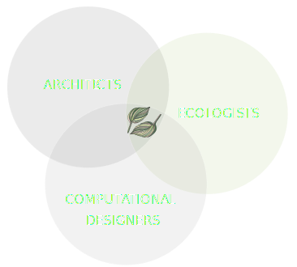  

*Rhino.Ecologic bridges ecology, computational design, and software engineering.*  

  

**Rhino.Ecologic** generates spatio-temporal maps of:

- Soil and precipitation conditions
- Light availability 
- Species distribution
- Biodiversity
- Biomass accumulation 

 

### 1.2  Why ecological modeling matters in landscape architecture 

As environmental pressures intensify across cities worldwide, landscape architecture is undergoing a structural transformation. The discipline can no longer focus solely on aesthetics, spatial organization, or human usability. It must now engage climate resilience, ecosystem stability, resource cycles, and the integration of non-human life as fundamental design parameters. This shift demands not only new strategies, but new tools capable of representing ecological processes within spatial decision-making.

Urban landscapes are hybrid systems: constructed, managed, and inhabited environments that simultaneously function as ecological habitats. They influence microclimates, hydrological flows, soil dynamics, and species movement. Yet traditional design workflows often rely on static assumptions: fixed planting schemes, simplified soil descriptions, and generalized species lists detached from long-term ecological dynamics. Such approaches rarely account for succession, shading effects, competition, dispersal, or the temporal development of plant communities.

Ecological modeling offers a fundamentally different approach by simulating how living systems evolve in response to spatial configuration and environmental constraints. By representing interactions among soil depth, solar exposure, precipitation, plant traits, and spatial structure, modeling frameworks make ecological performance measurable, testable, and adjustable within the design process itself.

This capability changes the temporal horizon of design. Green roofs can be evaluated not only for immediate coverage, but for long-term biomass development and species turnover. Planting strategies can be assessed for resilience under varying light conditions and soil depths, while urban districts can be tested for habitat connectivity, biodiversity potential, and adaptive capacity before construction. Trade-offs between biomass and diversity, density and ecological space, exposure and understorey viability become visible rather than speculative.

Ecological modeling does more than generate metrics; it reshapes design thinking. It reshapes design thinking. When vegetation is simulated as a dynamic system rather than inserted as a final layer, spatial decisions begin to anticipate growth, competition, and succession. Designers move from arranging static forms to configuring ecological conditions. Ecology becomes a co-author of spatial development rather than a constraint applied after geometry is fixed.

In this context, Rhino.Ecologic operates as an integrative bridge. By embedding ecological simulation within Rhino and Grasshopper, it enables designers to explore how spatial configurations influence biodiversity, biomass, and environmental performance over time.

The result is a shift from reactive validation to anticipatory design from checking ecological impact to shaping ecological trajectories. Landscape architecture, in this framework, evolves from managing planted surfaces to orchestrating living systems.
 
 

### 1.3 From data to design: Ecological insight through simulation 

Rhino.Ecologic differs from conventional environmental analysis tools not only in the data it processes, but in how ecological simulation is embedded within the design workflow. Rather than operating as a post-design evaluation layer, Rhino.Ecologic integrates ecological dynamics directly into the generative loop of parametric modeling.

At the core of this integration lies the coupling of a voxel-based spatial representation with an individual-based ecological simulation engine, the Joschinski Model (Joschinski et al., 2024). Together, these systems transform three-dimensional geometry into an ecological domain in which plant communities grow, compete, reproduce, and decline over time.

Design geometry is discretized into a structured volumetric grid. Each voxel stores environmental attributes derived from geographic location and spatial configuration, including soil depth, soil type, precipitation, and solar exposure. This discretized structure does more than store information; it defines the spatial topology of ecological interaction. Plants are not abstract coverage values but autonomous individuals responding locally to light availability, soil constraints, and neighboring competition.

Within this framework, ecological processes unfold across annual time steps. Germination, growth, biomass allocation, shading, reproduction, dispersal, and mortality are simulated sequentially. Solar radiation intercepted by plant crowns is converted into biomass according to species-specific efficiencies. Maintenance costs are subtracted, resources are allocated, and competition for light and space emerges from overlapping geometries rather than imposed ranking systems. Community structure is not prescribed; it develops from spatial interaction.

This integration fundamentally alters the design workflow. Each iteration of a 3D model becomes not only a geometric configuration but an ecological scenario. Changing a building mass, adjusting soil depth, reallocating biophilic areas, or modifying exposure conditions alters the long-term trajectory of vegetation development. Biodiversity and biomass are no longer abstract targets but measurable outcomes of spatial decisions. 

**Such a workflow enables designers to:** 

- Test adaptive green infrastructure strategies (roofs, terraces, corridors) 
- Evaluate long-term biodiversity development 
- Align planting schemes with site-specific conditions 
- Anticipate trade-offs between density, exposure, and ecological performance 

Crucially, the system shifts ecological data from static constraint to active design driver. Instead of asking whether a finished proposal satisfies environmental criteria, designers can explore how ecological performance emerges from parametric variation. Geometry, environmental data, and ecological processes operate within a continuous feedback loop. 

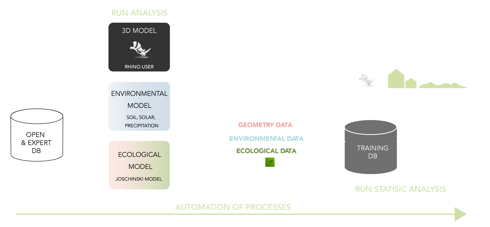

*System Architecture Rhino.Ecologic. © McNeel Europe 2026.* 
 

In this sense, Rhino.Ecologic does not merely visualize ecological conditions; it operationalizes them. It embeds ecological intelligence within computational design systems, allowing spatial decisions to be evaluated not only in terms of form and function, but in terms of long-term biological development.

The outcome is a unified framework in which aesthetics, performance, and ecology are no longer sequential concerns but interdependent components of a single generative process.
 
 

## Chapter 2: Rhino.Ecologic plugin overview 

Where Chapter 1 established the conceptual and methodological foundation of Rhino.Ecologic, this chapter introduces the software as an operational system within Rhino and Grasshopper. It explains how the plugin is installed, how it integrates into the user interface, and how ecological simulation components are structured within the parametric workflow.

Rhino.Ecologic operates natively inside Grasshopper. It does not replace Rhino’s modeling environment; rather, it extends it with ecological data types, analysis pipelines, and simulation logic that interact directly with geometry and environmental parameters.

This chapter provides the technical entry point into the system.
  

### 2.1  Installation 

#### 2.1.1 System requirements: 

- **Rhino:** 8.6 or later (Windows) 
- **Grasshopper:** bundled (requires GH build ≥ 1.0.0007) 
- **OS:** Windows 10/11 (64-bit) 
- **Runtime:** .NET 7 (Rhino 8 environment) / .NET Framework 4.8  
- **Dependencies:** xx  (`to be scpecified- add DLLs an Python`) 

> ⚠️ **Caution:** Rhino.Ecologic is currently supported on Windows only. 

#### 2.1.2 Installation procedure: 

Rhino.Ecologic is distributed as a YAK package and can be installed via: the Rhino <code>_PackageManager</code>

- 📦 `rhino.ecologic(r)-0.1.14-alpha-rh8_8-any.yak`
currently here: [https://drive.google.com/drive/folders/19XXtHdOQBpVMPuCLvl3ieOXPqRLiq0ws](https://drive.google.com/drive/folders/19XXtHdOQBpVMPuCLvl3ieOXPqRLiq0ws)
   
To install: 

1. Open Rhino 8. 
2. Run _PackageManager. 
3. Search for Rhino.Ecologic. 
4. Install the latest compatible version. 
5. Restart Rhino. 

After successful installation, a new tab labeled Rhino.Ecologic® will appear in the Grasshopper ribbon. 

 > 💡 **Tip:** For detailed step-by-step instructions, refer to the separate *Installation Guide*. 
 

### 2.2 User interface overview 

Once installed, Rhino.Ecologic integrates directly into the Grasshopper interface as a dedicated toolbar tab. The system follows standard Grasshopper conventions, ensuring familiarity for users experienced in parametric workflows. 

The plugin introduces structured component groups organized by function: Parameters, Project, Analysis, Data, Visualization, Utilities, Statistics, and Species Library.

Each tab represents a logical stage in the ecological simulation pipeline from defining a project to running analyses, extracting data, and visualizing results.

Rhino.Ecologic does not operate as a monolithic component. Instead, it follows Grasshopper’s modular paradigm: users assemble ecological workflows visually by connecting components that pass structured data objects. 

 

*Rhino.Ecologic® toolbar in Grasshopper.*

 
 

### 2.3 Interaction model and data flow 

Rhino.Ecologic inherits Grasshopper’s visual programming logic:

- Components process data from left to right
- Outputs from one component become inputs to another
- Data can be passed as `Items`, `Lists`, or `Trees`

Geometry and ecological data coexist within the same parametric graph. The typical ecological workflow follows this structure:

Create Project → Configure Parameters → Run Ecological Analysis → Extract Data → Visualize or Optimize 

Key interaction principles:

- `Preview`: Toggle viewport visualization per component. 
- `Bake`: Commit geometry to Rhino. 
- `Access Modes`: Adjust `Item`/`List`/`Tree` per input. 
- `Units`: Numerical inputs inherit Rhino document units unless otherwise specified. 

Because ecological simulation can be computationally intensive, it is recommended to: 

- Disable previews on heavy components when not needed. 
- Use appropriate voxel resolutions. 
- Run analyses only when geometry and parameters are stable. 
 

### 2.4 Grasshopper components 

Before we start introducing the Rhino.Ecologic Grasshopper components, let’s briefly review some general knowledge about Grasshopper components. In Grasshopper, there are six main types of components, each serving a different purpose within a definition: 

- **Parameter components** store, reference, and pass data without performing operations on it. They are used to reference Rhino geometry or create constant values, for example with Point, Curve, Number, Boolean, Text, Geometry, or Data parameters. The component name is often just the data type. 

- **Primitive** or **input components** create base data directly inside Grasshopper and provide user-adjustable input values, such as `Number Sliders`, `Panels` (for text), `Toggles` (True/False), or `Colour Swatches`.
- **Operator** or **logic components** perform calculations, comparisons, and data operations to manipulate numbers, vectors, or text—for example using `+`, `−`, `×`, `÷`, `Greater Than`, `Equality`, `Boolean logic gates`, `Domain`, or `Vector Math`.  
- **Geometry components** generate and modify geometry, enabling users to build or transform Rhino geometry parametrically; common examples include `Construct Point`, `Line`, `Loft`, `Extrude`, `Offset`, or `Project`.
- **Data management components** are used to organize, filter, and structure data, especially when working with complex `data trees` and `lists`; typical examples are `List Item`, `Cull Pattern`, `Split Tree`, `Merge`, `Flatten`, `Graft`, or `Path Mapper`.   
- Finally, **scripting** and **utility components** extend functionality or automate workflows, allowing for custom logic, algorithms, or automation through components like `C# Script`, `Python Script`, `VB Script`, `Evaluate Expression`, `Timer`, or `Data Recorder`. 
 

### 2.5 Component architecture Rhino.Ecologic 

Rhino.Ecologic extends Grasshopper by introducing new data types that represent ecological entities: `Project`, `Voxel`, `Plant`, `Plant Library`, and `Soil Set`. 

These are not simple values; they are structured data containers that store geometry-linked environmental and ecological attributes. 

The plugin components fall into four conceptual categories: 

1. **Initialization components:** Define project geometry, voxel resolution, and environmental context. 
2. **Analysis components:** Execute environmental and ecological analysis pipelines. 
3. **Data extraction components:** Deconstruct structured ecological outputs for inspection and further processing. 
4. **Interpretation components:** Visualize, summarize, optimize, and integrate results into design workflows. 

This layered structure mirrors the ecological modeling logic: Spatial domain definition, environmental condition mapping, individual-based plant simulation, post-processing and interpretation. 

By organizing components in this way, Rhino.Ecologic maintains transparency between geometry, environmental input, and ecological outcome. 

### 2.6 From geometry to ecological simulation  

At the operational level, Rhino.Ecologic transforms geometric models into ecological simulation domains through voxelization. Once a project is initialized: 

1. Geometry is discretized into volumetric cells. 
2. Environmental attributes are computed per voxel. 
3. Plant communities are simulated within this structured spatial network. 
4. Results are stored within the project object for further analysis. 

The system therefore functions as a bridge between parametric geometry and dynamic ecological modeling without requiring users to leave the Grasshopper environment. 

With the system installed and the interface understood, the next chapter documents each Rhino.Ecologic component in detail. Chapter 3 provides a structured reference of all tabs, inputs, outputs, and operational parameters within the plugin.
 
 

## Chapter 3: Rhino.Ecologic Grasshopper components 

Chapter 3 provides a structured reference of all Rhino.Ecologic components organized by toolbar tab. Each section documents component purpose, inputs, outputs, and workflow integration.
The components are grouped into the following functional tabs: `00 Parameters`, `01 Project`, `02 Analysis`, `03 Data`, `04 Visualizations`, `05 Utilities`, `06 Statistics` and `07 Species Libraries`. 
 

 > 💡 **Tip:** For a step-by-step introduction to creating, importing, and saving projects, refer to the *Quick Start Guide*, which provides a structured walkthrough of the complete setup and analysis workflow. 
 

### 3.1 Parameters tab 

The **Parameters tab** introduces core Rhino.Ecologic data types. These parameter components function as structured data containers and enable the transfer of ecological entities across the Grasshopper definition without modification.

Unlike numerical or geometric parameters, these components encapsulate simulation-specific objects such as `Project`, `Voxel`, `Plant`, `Plant Library`, and `Soil Set`. You will find them located at the far left side of the first tab under `Parameters`. Both Parameter components store, reference, or pass data without performing any operation on it. 

#### 3.1.1 Parameter tab overview 

 | GH Icon    | Feature | Category/ Subcategory | Description |
|--------- |------------------------------|---------------|---------------|
|     |  *Project (P)* |  Rhino.Ecologic® / Parameters | *Represents a Rhino.Ecologic project. The component stores and passes the data of your Rhino.Ecologic project.*
|    |  *Voxel (V)* | Rhino.Ecologic® / Parameters  | *Represents a space boundary with specific attributes. This component stores and passes all data associated with each voxel in your Rhino.Ecologic project.*
|    |  *Plant (PL)* | Rhino.Ecologic® / Parameters  | Represents a description of a plant.
|    |  *Plant Library (PLL)* | Rhino.Ecologic® / Parameters  | *Represents a set of plants comprising a library.*
|    |  *Soil Set (S)* | Rhino.Ecologic® / Parameters  | *Represents a set of soils that can provide a nurturing environment for a plant.*
 

### 3.2 Project tab 

The **Project** tab appears as the second tab in the menu, next to **Parameters**. This tab includes Grasshopper components for creating a new Rhino.Ecologic project, importing existing projects, and saving your project locally. 

The Project tab defines the ecological simulation domain. It is the entry point for transforming geometric input into a structured Rhino.Ecologic project object.

All ecological analyses in Rhino.Ecologic operate on a `Project` data type. This object encapsulates: Project metadata (`Title`, `Location`, `Longitude` and `Latidude`), referenced `Geometry`, Voxelized spatial domain (Voxel graph), environmental and ecological attributes, and the simulation state (`Time Stamp`).  

The Project tab provides three core operations: 

1. `Create Project` a new project from geometry 
2. `Import Project` an existing serialized project 
3. `Save Project` a project state for reuse or versioning 
 

#### 3.2.1 Project component overview 

| GH Icon    | Feature | Category/ Subcategory | Description |Input parameters |Output|
|--------- |------------------------------|---------------|---------------|------------------------------|------------------------------|
|   |  *Create Project (CP)* | Rhino.Ecologic® / Project | *Constructs a new Rhino.Ecologic project for analysis. The components converts geometry to mesh, voxelizes the bounding volume, and separates the graph into subgraphs such as interior and exterior envelopes.object.* |Title, Location, Longitude, Latitude, Geometry, Biophilic Area, Voxel Size|Rhino.Ecologic Project|
|   |  *Import Project (IP)* | Rhino.Ecologic® / Project | *Imports a project from a binary (.bph) file. Json deserialization is supported in the debug version.*|Project Path|Rhino.Ecologic Project|
|   |  *Save Project (SP)* | Rhino.Ecologic® / Project | *Saves a project as a binary (.bhp) file. Json serialization is supported in the debug version.* |Project, Save Directory, Serialize |Rhino.Ecologic Project|
 

#### 3.2.2  Create Project  

The `Create Project` component converts a 3D model into a Rhino.Ecologic Project, forming the computational basis for all subsequent environmental and ecological analyses.

The component processes the input geometry and generates a Rhino.Ecologic project instance, including a unique project ID and associated metadata such as `Title`, `Location`, `Latitude`, and complete project `Geometry`. The geometry is voxelized at a user-defined resolution, producing voxel IDs and mesh representations for each cell. These voxel entities define the spatial domain of ecological simulation.

Project initialization requires:

1. A 3D model in Rhino or Grasshopper 
2. A project name 
3. Geographic location data 

Supported geometry types include: **BReps**, **SubDs**, and **Meshes**. 

The `Geometry` input references the 3D model defining the spatial envelope. The `Voxel Size` parameter determines the resolution of the volumetric discretization. 

 > 💡 **Tip:** A voxel size of 1 meter is recommended. Rhino document units should be set to meters to ensure ecological plausibility and correct environmental scaling. 
 

*Project initialization based on referenced 3D geometry.* 
 

During project creation: 
- Geometry is converted into mesh format 
- the bounding volume is discretized into a structured voxel grid 
- each voxel receives a unique identifier 
- subgraphs are constructed (e.g., interior, exterior, envelope) 

The resulting voxel graph establishes the spatial topology on which environmental mapping and plant community dynamics operate. 

The generated `Rhino.Ecologic Project` object stores project metadata, a voxel graph, the spatial envelope, and associated geometric representations. 

This object serves as the primary input for all analysis components in subsequent workflow stages. 

The `Biophilic Areas` input allows restriction of ecological analysis to specified regions within the overall geometry. If left empty, environmental and ecological analyses are executed across the entire project domain. If bounding geometries are provided, only voxels intersecting these volumes are included in the simulation. This enables targeted ecological evaluation within defined spatial subsets of the model.  

*To analyze only specific regions of your project, reference a `bounding box` (or multiple boxes) around those areas to the `Biophilic Areas` input.* 
 

#### 3.2.3  Import  and  Save Projet 

The `Import Project` and `Save Project` components support project persistence across sessions and workflows. The `Import Project` component loads an existing serialized Rhino.Ecologic project, restoring its full state and enabling continuation of a previously executed analysis. The `Save Project` component serializes the current project state and stores it as a `.reproj` file. This enables project reuse, version control, archival storage, and exchange between collaborators.  

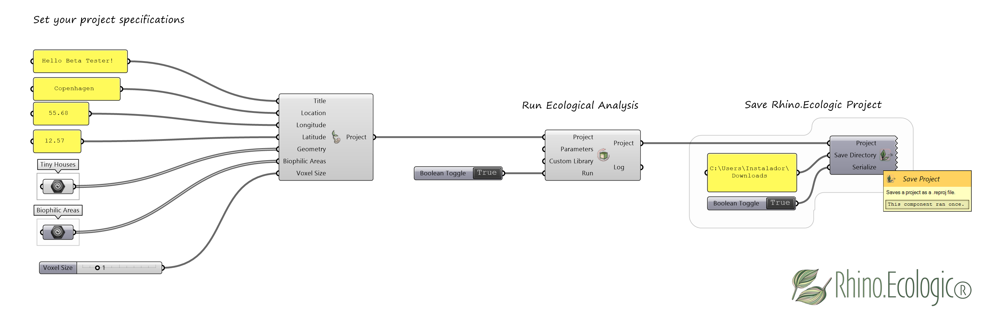

*Save a Rhino.Ecologic Project.* 
 

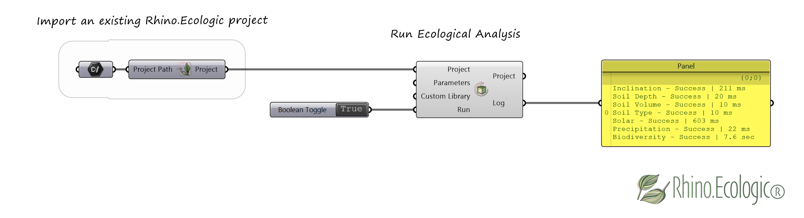

*Import an existing Rhino.Ecologic Project.* 
 
                                                     
                                                     
> 💡 **Tip:** To repeat this exercise using your own setup, you can use the Tutorial template 🦗 Grasshopper files ***Rhino.Ecologic_QuickStart.gh*** and ***Rhino.Ecologic_Import_Export.gh***, and the 🦏 Rhino 3D model example file ***Rhino.Ecologic_Example_Wood_Cabins.3dm***, which are available by hovering over the **Rhino.Ecologic tab** at the top of the Grasshopper menu.
 

#### 3.2.4 Project tab inputs 

*The table below details the inputs of the **Project tab**, including their `type`, `access`, and `units`.*

| Input| Label (GH)            | Type                | Access     | Units             | Description            | 
|:------:|-----------------------|---------------------|------------|-------------------| -------------------|
| `Title`  | `T`       | `Text`             |`Item`      |  `N/A`  |     *Title of the project.*
| `Location`  | `L`       | `Text`             | `Item`      |   `N/A`   | *Location of the project.*   
| `Longitude`  | `Lon`       | `Integer`             | `Item`    | `Degrees`    | *Longitude of the project's location.*  
| `Latitude`  | `Lat`       | `Integer`             | `Item`   |   `Degrees`    | *Latitude of the project's location.*  
| `Geometry`  | `G`       | `Geometry`             | `Tree`      | `N/A`          | *Geometry of the project.*
| `Biophilic areas`  | `BA`       | `Geometry`             | `Tree`      | `N/A`          | *Geometry for the biophilic areas.* **This input can be left empty.**
| `Voxel size`  | `VS`       | `Number`             | `Item`     | `Model units`          | *Voxel size for the analysis.*
| `Save directory`  | `SD`       | `Text`             | `Item`     | `File Path`          | *The directory to save the serialized project to.*
| `Serialize`  | `S`       | `Boolean`             | `Item`      | `True/False`   | *True to serialize and false not to.*  
 

#### 3.2.5 Project tab output 

The project components outputs a `Rhino.Ecologic Project (P)`, a structured data object encapsulating geometry, voxel graph, metadata, and simulation state.

This object forms the required input for all downstream environmental and ecological analysis components.

*The table below details the outputs of the **Project tab**, including their `type`, `access`, and `units`.*

| Output | Label (GH)            | Type                | Access     | Units             | Description            | 
|:------:|-----------------------|---------------------|------------|-------------------|-------------------|
| `Rhino.Ecologic Project`  | `P`       | `Parameter`             | `Item`      | `N/A` | *Rhino.Ecologic Project.*
 

### 3.3 Analysis tab 

The **Analysis tab** is positioned adjacent to the **Project tab** and contains components responsible for environmental computation, ecological simulation (see Chapter 4), and post-processing of project data.

Its central component, `Run Ecological Analysis`, executes the full environmental and ecological analysis pipeline on the active voxelized project domain. The component processes solar exposure, soil conditions, precipitation distribution, and plant community dynamics based on the current project configuration.

Environmental and ecological behavior can be parameterized using the following components: `Biodiversity Parameters`, `Solar Parameters`, and `Soil Depth Parameters`. These parameter components define project-specific simulation settings and control model behavior prior to execution of the analysis pipeline. 

#### 3.3.1 Analysis tab component overview 

The following components constitute the **Analysis tab** and define the environmental, ecological, and data-processing pipeline executed on the active `Rhino.Ecologic Project`. 

| GH Icon    | Feature | Category/ Subcategory | Description |Input parameters |Output|
|--------- |------------------------------|---------------|---------------|------------------------------|------------------------------|
|    |  *Run Ecological Analysis (EA)* | Rhino.Ecologic®/ Analysis | *Runs a configurable pipeline of analysis. This pipeline includes solar, soil, precipitation and biodiversity analysis, allowing for configuratiion (which analyses are run).* |Project, Parameters, Run, Custom Library |Rhino.Ecologic Project, Log|
|     |  *Biodiversity Parameters (BP)* | Rhino.Ecologic®/ Analysis | *Creates a set of parameters for the biodiversity analysis.* |Simulation Duration| Parameters|
|     |  *Solar Parameters (SP)*|  *Rhino.Ecologic®/ Analysis |Creates a set of customized analysis parameters to configure the solar analysis execution including radiation and daylight analysis.* |Hour Interval, Annual Frequency, Noon Hour, Day of Year, Plot Scale, Accumulative, Analysis Type, Analysis Span, Max Voxel Count, Max Depth, Min Surface Area| Parameters|
|     |  *Soil Depth Parameters* (SDP)| Rhino.Ecologic®/ Analysis | *Creates a set of customized analysis parameters to configure the soil depth analysis execution.* | Lower Height Depth | Parameters|
|     | *Run Data Analysis* (DA)|  Rhino.Ecologic®/ Analysis | *Runs the data analysis pipeline and produces visualizations.* |Rhino.Ecologic Project, Run|Bitmaps, Vector, Log|
 

#### 3.3.2  Run Ecological Analysis 

The `Run Ecological Analysis` component executes the environmental and ecological simulation pipeline on the active Rhino.Ecologic Project.

Default configuration: In its default configuration, the component operates using internal default settings for `Parameters` and `Custom Library`. The environmental and ecological analysis pipeline is triggered by setting the `Run` boolean from `False` (inactive) to `True` (active). Execution includes: Inclination analysis, Solar analysis, Precipitation analysis, Biodiversity analysis including Species distribution, Abundance, Biomass, and Plant Volume. 

*Execution of the environmental and ecological analysis pipeline using default parameter and library settings.* 
 

Customized configuration: The analysis pipeline can be parameterized through the following components: `Biodiversity Parameters`, `Solar Parameters`, and `Soil Depth Parameters`. 

In addition, a `Custom Library` may be supplied to define project-specific plant species and trait configurations. 

Biodiversity Parameter customization: Simulation duration are defined through the `Biodiversity Parameter` component. In the example below, the simulation duration is set to 100 timesteps, corresponding to a total period of 100 years.

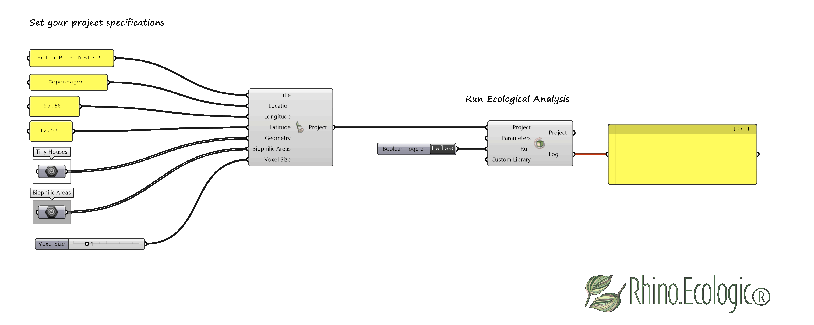

*Customized environmental and ecological analysis using modified `Biodiversity Parameter`.* 
  

Soil Depth Parameter customization: Soil depth behavior and vertical constraints are defined through the `Soil Depth Parameters` component.

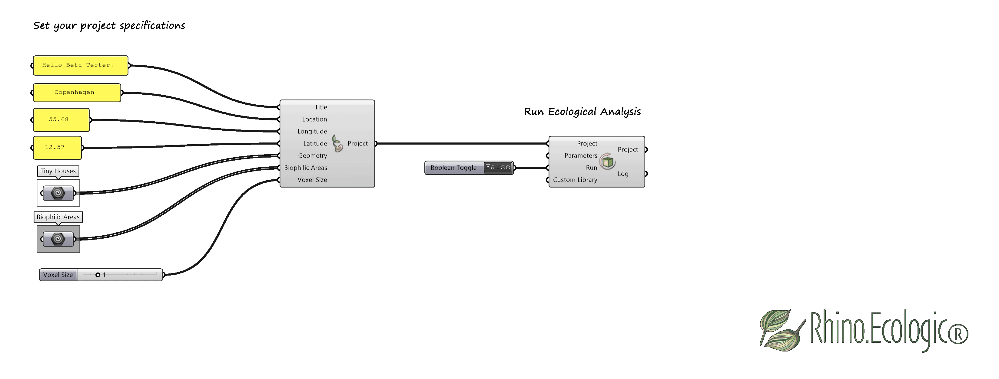

*Customized environmental and ecological analysis using modified `Soil Depth Parameters`.* 
 

Solar Parameter customization: Solar exposure and irradiation analysis are configured through the `Solar Parameters` component. Adjustable parameters include:
`Analysis Type` from `Sunlight Hours` to `Irradiation`, `Analysis Span` from `Days` to `Years`, and specifications for a particular `Day of Year` and `Noon Hour`. These parameters define the temporal and methodological scope of solar computation.

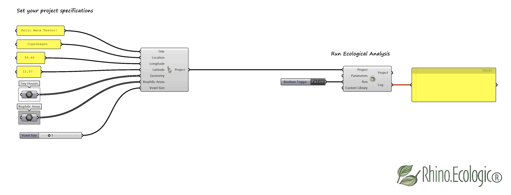

*Customized environmental and ecological analysis using modified `Solar Parameters`.* 
  

Custom Library integration: A `Custom Library` may be provided as a `Plant Library` containing site-specific species definitions. Rhino.Ecologic includes predefined ecosystem-based example libraries (see Section 3.8 – Species Library Tab).
 
 

#### 3.3.3   Run Data Analysis 

The `Run Data Analysis` component performs statistical post-processing of simulation results generated by `Run Ecological Analysis`. The components processes environmental data (soil, solar, precipitation), geometry- derived data, and spatio-temporal ecological including biomass, species type and distribution, abundance (biodiversity), and plant volume.

Execution requires a valid `Rhino.Ecologic Project (P)` input. The analysis pipeline is triggered by setting the `Run` boolean to `True`.

Outputs include: Bitmap charts (raster images), and Vector charts exported as SVG. These outputs provide aggregated representations of simulation results suitable for documentation, reporting, and comparative scenario evaluation.
 

´

*Execution of the data analysis pipeline.* 
   

 

#### 3.3.4 Analysis tab Inputs 

The tables below provide further information about `Type`, `Acess`, and `Units` for each input of the **Analysis tab**. 

| Input| Label (GH)            | Type                | Access     | Units             | Description            | 
|:------:|-----------------------|---------------------|------------|-------------------|-------------------|
| `Rhino.Ecologic Project`  | `P`       | `Parameter`             | `Item`      | `N/A` | *The Rhino.Ecologic project to analyse.*     
| `Parameters`  | `Param`       | `Parameter`             | `List`      |   `N/A`   |   *Optional parameters for the analysis.* **This input can be left empty.**
| `Run`  | `Run`       | `Boolean`             | `Item`      | `True/False`   | *Run the analysis pipeline.*   
| `Custom Library`  | `CL`       | `Custom/Optional Library Parameter`             | `Item`      |   `N/A`    | *Optional library to use. It can be either a path to a serialized library or a plant library created via the respective components.* **This input can be left empty.**

 

Inputs for a customized `Run Ecological Analysis` setup (optional): 

| Input| Label (GH)            | Type                | Access     | Units             | Description            | 
|:------:|-----------------------|---------------------|------------|-------------------|-------------------|
| `Simulation Duration`  | `SimD`       | `Integer`             | `Item`      |   `Years`    | *The model simulates the plant community over this number of years. The number of outputs is always constrained to 10; if SimD is larger, only a fraction of the simulation results is exported. To simulate long-lived tree communities, for example, set the duration to 100. This will export only every 10th year. Short-lived communities (grassland, urban areas) tend to converge much faster (10 years).*
| `Lower Height Soil Depth`  | `MinSD`       | `Number`             | `Item`      | `Model units`    | *The soil depth at the lowest point. The default value is 1.5 cm.*
| `Hour Interval`  | `Int`       | `Integer`             | `Item`      | `Hour`    | *The interval to use in the day evaluation. The default value is 1 hour.*
| `Annual Frequency`  | `AF`       | `Integer`             | `Item`      | `Days`    | *Annual Frequency of the analysis in days.*
| `Noon Hour`  | `Hour`       | `Integer`             | `Item`      | `Hour`    | *The hour that signifies the highest solar position.*
| `Day of Year`  | `Day`       | `Integer`             | `Item`      | `Day`    | *The Julian day to use for daily spans.*
| `Plot Scale`  | `PSca`       | `Number`             | `Item`      | `Scale`    | *The plot scale for the sun positions.*
| `Accumulative`  | `Acc`       | `Boolean`             | `Item`      | `True/False`     | *Signifies if the year spans accumulate on average the values. By default set to true.*
| `Analysis Type`  | `AT`       | `Integer`             | `Item`      | `0/1`    | *0 for Sunlight Hours, 1 for Irradiance.*
| `Analysis Span`  | `AS`       | `Integer`             | `Item`      | `0/1`   | *0 for Daily Span, 1 for Yearly Span.*

 

#### 3.3.5 Analysis tab Outputs 

The table provides `Type`, `Acess`, and `Units` for each output of the **Analysis tab**. 

| Output | Label (GH)            | Type                | Access     | Units             |  Description            | 
|:------:|-----------------------|---------------------|------------|-------------------|-------------------|
| `Rhino.Ecologic Project`  | `P`       | `Parameter`             | `Item`      | `N/A` | *The analysed project.*
| `Log`  | `L`       | `Text`             | `List`      | `N/A` | *The log of the analysis.*
| `Parameters`  | `Param`       | `Parameter`             | `List`      | `N/A` | *The resulting biodiversity parameters.*
| `Bitmaps`  | `Graph`       | `Data`             | `Item`      | `N/A` | *Graphs as raster images.*
| `Vector`  | `VGraph`       | `Data`             | `Item`      | `N/A` | *Graphs as vector images.*

 

> 💡 **Tip:** To repeat this exercise using your own setup, you can use the Tutorial template 🦗 Grasshopper files ***Rhino.Ecologic_Growth_Simulation.gh***, ***Rhino.Ecologic_Custom_Parameters.gh***, and ***Rhino.Ecologic_Custom_Plant_Library.gh***, and the 🦏 Rhino 3D model example file ***Rhino.Ecologic_Example_Wood_Cabins.3dm***, which are available by hovering over the **Rhino.Ecologic tab** at the top of the Grasshopper menu. 

 

### 3.4 Data tab 

The **Data tab** is positioned adjacent to the **Analysis tab** and contains components for accessing, extracting, and modifying environmental and ecological data within a Rhino.Ecologic project.

All components operate on the voxelized project domain and return data at the predefined spatial resolution (`Voxel Size`). The extracted data represents the environmental conditions and ecological state computed during the analysis stage.

The Data tab provides two primary functions:

1. Deconstruction of project and voxel data into accessible attributes  
2. Assignment and modification of project and voxel-level data  

The resulting data can be used for downstream processing, custom visualization, and integration with external workflows within Grasshopper. 

#### 3.4.1 Data component overview 

The following components constitute the **Data tab** and define the data extraction and manipulation workflows available for a `Rhino.Ecologic Project`. 

| GH Icon    | Feature | Category/ Subcategory | Description |Input parameters |Output|
|--------- |------------------------------|---------------|---------------|------------------------------|------------------------------|
|    |  *Deconstruct Project* |Rhino.Ecologic®/ Data | *Deconstructs a project object to its constituent parts: Geometry-, solar-, precipitation-, soil-, and biodiversity related attributes. It only filters and outputs the voxels set by the user, e.g. only the exterior envelope voxels.* |Rhino.Ecologic Project|Title, Id, Location, Longitude, Latitude, Elevation, North, Timestamp, Voxels, Mesh|
|     |  *Deconstruct Voxel* | Rhino.Ecologic®/ Data |*Deconstructs a voxel to its constituent parts.* |Voxel, Time Step|Id, Mesh, Position, Size, Inclination, Solar, Soil Depth, Soil Volume, Soil Type, Precipitation, Timestamp, Species, Biomass, Abundance, Plant Volume|
|    |  *Set Project Data*| Rhino.Ecologic®/ Data | *Sets the value of the selected project field: Title, Location, Longitude, Latitude, Elevation, Geometry, and Voxels* | Project, Parameter, Value | Rhino.Ecologic Project |
|     | *Set Voxel Data*| Rhino.Ecologic®/ Data |*Sets the value of the selected voxel field.* | Voxels, Analysis Type, Analysis Values  | Voxels  |

 

#### 3.4.2  Deconstruct Project 

The `Deconstruct Project` component extracts project-level data from a Rhino.Ecologic `Project (P)` object.  

The component separates the project into its constituent data layers, including: Geometry, Solar data, Precipitation data, Soil attributes, and Biodiversity attributes.  

In addition, the component supports filtering of voxel subsets (e.g., exterior or envelope voxels), enabling selective access to spatial regions within the project domain. 

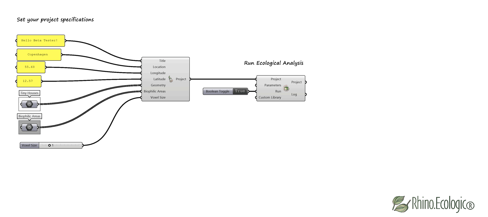

*Extraction of Rhino.Ecologic project data using the `Deconstruct Project` component.*  

 
 

#### 3.4.3  Deconstruct Voxel 

The `Deconstruct Voxel` component extracts voxel-level data from an analysed Rhino.Ecologic `Project (P)`.

The component returns data across the following categories:

- **Geometry:** `Id`, `Mesh`, `Position`, `Size`, `Inclination`  
- **Environmental:** `Solar`, `Soil Depth`, `Soil Volume`, `Soil Type`, `Precipitation`  
- **Ecological:** `Timestamp`, `Species`, `Biomass`, `Abundance / Biodiversity`, `Plant Volume`  

Voxel data corresponds to the environmental and ecological state computed during the analysis stage and reflects the spatial discretization defined by the project’s voxel resolution.

*Extraction of voxel data using the `Get Voxels by Type` component. Selection of `Exterior Envelope` returns results for the project envelope.*  

 

Temporal selection is controlled through the `Time Step` input, which defines the simulation year for which ecological data is returned.

*Ecological results retrieved for individual simulation timesteps.*  

 

 

#### 3.4.4  Set Project Data 

The `Set Project Data` component modifies project-level attributes of a Rhino.Ecologic `Project (P)`.

The component provides access to core project properties, including:`Title`, `ID`, `Location`, `Longitude`, `Latitude`, `Elevation`, `North`, `Timestamp`, `Voxels`, and `Mesh` of your project. 

These attributes define the project’s metadata, spatial configuration, and environmental reference parameters.

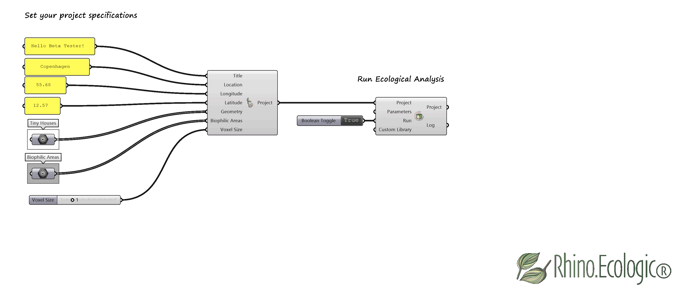
  
*Modification of project-level attributes using the `Set Project Data` component. Geometry inputs may be redefined to evaluate subsets of the original project domain.*  

 

 

#### 3.4.5  Set Voxel Data 

The `Set Voxel Data` component modifies voxel-level attributes for a specified `Analysis Type`.

Supported analysis types include, for example: `Soil Depth`, `Solar`, or `Biomass`.  

Custom values can be assigned through the `Analysis Values` input, enabling controlled modification of environmental or ecological parameters at voxel resolution.

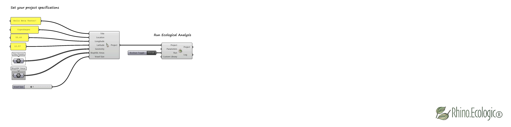
  
*Modification of voxel-level attributes. In this example, soil depth is adjusted and the voxel data is updated accordingly.*  

 

 

#### 3.4.6 Data tab Inputs 

The following table defines the `Type`, `Access`, and `Units` for each input in the **Data tab**. 

| Input | Label (GH) | Type | Access | Units | Description |
|:------:|-----------------------|---------------------|------------|-------------------|-------------------|
| `Rhino.Ecologic Project` | `P` | `Parameter` | `Item` | `N/A` | The Rhino.Ecologic project to deconstruct or modify |
| `Voxel` | `V` | `Parameter` | `Item` | `N/A` | The voxel to deconstruct or modify |
| `Time Step` | `TS` | `Integer` | `Item` | `N/A` | The simulation timestep associated with the data |
| `Parameter` | `Param` | `Integer` | `Item` | `N/A` | Identifier of the parameter to assign or modify |
| `Value` | `Val` | `Integer` | `Item` | `N/A` | Value assigned to the specified parameter |
| `Analysis Type` | `AT` | `Integer` | `Item` | `N/A` | Attribute category to be modified (e.g., soil, solar, biomass) |
| `Analysis Value` | `AV` | `Text` | `List` | `N/A` | Values assigned to the selected analysis attribute |

 

#### 3.4.7 Data tab Outputs 

The following table defines the `Type`, `Access`, and `Units` for each output in the **Data tab**. 

| Output | Label (GH) | Type | Access | Units | Description |
|:------:|-----------------------|---------------------|------------|-------------------|-------------|
| `Title` | `T` | `Text` | `Item` | `N/A` | Project title |
| `Id` | `Id` | `Text` | `Item` | `N/A` | Unique project identifier |
| `Location` | `Loc` | `Text` | `Item` | `N/A` | Project location |
| `Longitude` | `Lon` | `Integer` | `Item` | `Degree` | Geographic longitude |
| `Latitude` | `Lat` | `Integer` | `Item` | `Degree` | Geographic latitude |
| `Elevation` | `EL` | `Number` | `Item` | `Model units` | Project elevation |
| `North` | `North` | `Number` | `Item` | `Degree` | Rotation of the north vector |
| `Timestamp` | `TSt` | `Text` | `Item` | `N/A` | Project timestamp |
| `Voxels` | `V` | `Parameter` | `List` | `N/A` | Collection of project voxels |
| `Mesh` | `M` | `Mesh` | `Item` | `N/A` | Project mesh |
| `Id` | `Id` | `Text` | `List` | `N/A` | Unique voxel identifier |
| `Mesh` | `M` | `Mesh` | `List` | `N/A` | Voxel mesh |
| `Position` | `Pos` | `Point` | `List` | `Model units` | Voxel centroid position |
| `Size` | `VS` | `Vector` | `List` | `Model units` | Voxel dimensions along X, Y, Z |
| `Inclination` | `I` | `Number` | `List` | `N/A` | Surface inclination values |
| `Solar` | `S` | `Number` | `List` | `0–1` | Solar exposure (0 = fully shaded, 1 = fully exposed) |
| `Soil Depth` | `SD` | `Number` | `List` | `Model units` | Soil depth per voxel |
| `Soil Volume` | `SV` | `Number` | `List` | `Model units` | Soil volume per voxel |
| `Soil Type` | `ST` | `Text` | `List` | `N/A` | Soil classification |
| `Precipitation` | `PRE` | `Number` | `List` | `Model units` | Precipitation per voxel |
| `Timestamp` | `TSt` | `Text` | `List` | `N/A` | Simulation timestep |
| `Species` | `SP` | `Text` | `Tree` | `N/A` | Species present in the voxel at the selected timestep |
| `Biomass` | `BM` | `Number` | `Tree` | `g` | Biomass per species in the voxel |
| `Abundance` | `AB` | `Integer` | `Tree` | `Count` | Number of individuals per species |
| `Plant Volume` | `PV` | `Number` | `List` | `cm³` | Total leaf volume within the voxel |
| `Rhino.Ecologic Project` | `P` | `Parameter` | `Item` | `N/A` | Updated project object |
| `Voxels` | `V` | `Parameter` | `Item` | `N/A` | Voxels with modified attributes |

 

> ⚠️ **Caution:** `Species`, `Abundance`, and `Biomass` are mapped to plant origin locations and occur only in voxels containing soil. For visualization, filter voxels with the `Exterior Envelope` property. 
 

> 💡 **Tip:** Example workflows are available in the tutorial templates ***Rhino.Ecologic_QuickStart.gh*** and ***Rhino.Ecologic_Data_Inspection.gh***, together with the Rhino model ***Rhino.Ecologic_Example_Wood_Cabins.3dm***. These can be accessed via the **Rhino.Ecologic tab** in the Grasshopper interface. 

 

### 3.5 Visualization tab 

The **Visualization** tab sits next to the **Data** tab and includes the Grasshopper components `Visualize Analysis` and `Graph Display`. 
Visualizing your data has the following advantages: 

1. It helps you quickly spot patterns and outliers
2. You can compare scenarios across time steps
3. You can validate assumptions and communicate results clearly to stakeholders

It also improves QA/QC by revealing data gaps or errors, supports faster design decisions, and allows customization (e.g., gradients, voxel types, attributes) for task-specific insights. Finally, visuals can be exported (bitmap/SVG) for reports and presentations. 

The `Visualize Analysis` component (Section 2.5.1) displays the data from your analysis, while `Graph Display` (Section 2.5.3) generates graphical representations of the analyzed data, which can be exported as either bitmap images or vector-based SVG files. In the following section, you will see how both components are used. Additionally, you will learn how to display your analysis results in Rhino using standard Grasshopper components (Section 2.5.2). 

#### 3.5.1 Visualization tab component overview 

The tables below describe the Grasshopper components in the **Visualization tab**. 

| GH Icon    | Feature | Category/ Subcategory | Description |Input parameters |Output|
|--------- |------------------------------|---------------|---------------|------------------------------|------------------------------|
|    |  *Visualize Analysis (VA)* | Rhino.Ecologic®/ Visualization | Visualize the data of the analysis. |Project, Voxel Type, Attribute, Time Step, Show |Visualization|
|      |  *Graph Display (GD)* | Rhino.Ecologic®/ Visualization  | Visualizes graphs in the form of a bitmap or svg. |Project Data| Graph Display|

 

#### 3.5.1  Visualize Analysis 

To visualize your data, drag the `Visualize Analysis` Grasshopper component onto the canvas and connect it to your Rhino.Ecologic project. Set the `Voxel Types`, `Analysis Type`/ `Attributes`, and `Time Steps` inputs to visualize your analysis results in Rhino. 

  
*Setup of the `Visualize Analysis` component with changing `Value List` inputs.* 
 

 

#### 3.5.2 Visualization of data using standard Grasshopper components 

Alternatively, you can use standard Grasshopper components such as `Domains` from the **Math tab** and `Gradient` from the **Params tab** to visualize the data outputs in Rhino. Using standard Grasshopper components for visualizing analysis results offers the advantage of allowing you to adjust gradient colors and types as needed. 

 

*Access `Solar` data associated with your project's geolocation: `Daylight Hours` and `Irradiation`.* 
 
 

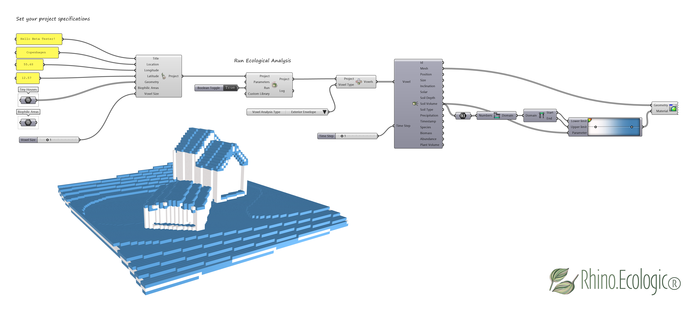 

*Access `Precipitation` data associated with your project's geolocation.* 
 
 

 

*Access `Soil` data of your project: `Soil Depth`, `Soil Volume` and `Soil Type`.* 
 

 

 

*Access ecological analysis data for your project. Modify the `Time Steps` to simulate ecological changes over time. This example shows the `Biomass` for each voxel cell at the level of the `Exterior Envelope`. The simulation results are shown without `trees`, including only `herbaceous vegetation`.* 
 

 

 

*The next example of the `Biomass` simulation shows `trees`, `shrubs`, and `herbs`. As the trees mature, they shade the lower layers, reducing the growth of smaller plants. The dark green voxels represent the locations where trees begin to grow.* 
 

 

 

*This example shows the `Plant Volume` simulation results for a `Species Library` consisting of trees, shrubs, and herbs. The key difference compared to `Biomass` is that `Plant Volume` quantifies the geometric volume occupied by vegetation in each voxel, whereas `Biomass` measures the accumulated biological dry mass.* 
 

 

 

*Obtain ecological simulation results for a specific species by applying a filter. Use standard Grasshopper methods to extract the desired species from the Species Distribution results.* 
  

 

#### 3.5.3  Graph Display 
 

> ⚠️ **Caution:** Only available in the Degug Version. 
 

Run a post-process analysis on the ecological analysis data using `Run Data Analysis`, then visualise the results with `Graph Display`. To choose which time step to display, connect a native Grasshopper `List Item` component to `Graph Display` and set the index to the desired time step. Graphs can be displayed and exported either as a `Bitmap` image or as a `Vector` graphic.  

`Explain different graphs and what they mean, the model behind and why this information is useful, at least half a page`

 
  
*Visualisation of post-processed analysis results at a selected time step.* 
 

 

#### 3.5.4 Visualization tab Inputs 

The table shows the `Type`, `Access`, and `Units` for each input in the **Visualisation tab**. 

| Input| Label (GH)            | Type                | Access     | Units             | Description            | 
|:------:|-----------------------|---------------------|------------|-------------------|-------------------|
| `Project`  | `P`       | `Parameter`             | `Item`      | `N/A` | The Rhino.Ecologic project to visualize.
| `Voxel Type`  | `VT`       | `Integer`             | `Item`      | `N/A` | Voxel Type to visualize.
| `Analysis Type`  | `AT`       | `Integer`             | `Item`      | `N/A` | Attribute to set.
| `Time Step`  | `TS`       | `Integer`             | `Item`      | `N/A` | The time step to visualize.
| `Show`  | `Show`       | `Boolean`             | `Item`      | `True/False`   | Show the visialization set to `True`.  

 

#### 3.5.5 Visualization tab Outputs 

The table provides information about the `Type`, `Access`, and `Units` for the **Visualisation tab** outputs. 

| Output | Label (GH)            | Type                | Access     | Units             | Description |
|:------:|-----------------------|---------------------|------------|-------------------|-------------|
| `Bitmap`  | `xx`         |  `xx`          |  `xx`        | `xx`          | `xx`   |
| `SVG`  | `xx`         |  `xx`         |  `xx`         | `xx`          | `xx`   |

 

> 💡 **Tip:** To repeat this exercise using your own setup, you can use the Tutorial template 🦗 Grasshopper files ***Rhino.Ecologic_QuickStart.gh***, ***Rhino.Ecologic_Visualisation.gh*** and ***Rhino.Ecologic_Data_Analysis.gh***, and the 🦏 Rhino 3D model example file ***Rhino.Ecologic_Example_Wood_Cabins.3dm***, which are available by hovering over the **Rhino.Ecologic tab** at the top of the Grasshopper menu. 

 

### 3.6 Utilities tab 

The **Utilities** components provide supporting tools for managing, inspecting, and refining project data within the workflow. 
They allow users to adjust project settings, filter and access simulation outputs, and prepare data for analysis or visualization.
The **Utilities** tab sits next to the **Visualization** tab and includes the following Grasshopper components: `Get Annual Sun Positions`, `Get Daily Sun Positions`, `Get Biophilic Voxels`, `Get Plant Voxels`, `Get Voxels by Type`, and an educational component on soil types called `Get Soil Description`. The functionality of each of these components is described below. 

 

The table below gives an overview of the Grasshopper components available in the **Utilities tab**. 

| GH Icon    | Feature | Category/ Subcategory | Description |Input parameters |Output|
|--------- |------------------------------|---------------|---------------|------------------------------|------------------------------|
|    |  *Get Annual Sun Positions (ASP)* | Rhino.Ecologic®/ Utilities | Calculates the sun positions of the location specified in the project. |Project, Annual Frequency, Hour Interval |Sun Positions|
|      |  *Get Daily Sun Positions (DSP)* | Rhino.Ecologic®/ Utilities  | Gets the sun positions of the location specified in the project on the specific day. |Project, Day | Sun Positions|
|      |  *Get Biophilic Voxels (GBV)* | Rhino.Ecologic®/ Utilities  | Gets voxels marked as biophilic. |Project, Day | Voxels|
|      |  *Get Plant Voxels (GPV)* | Rhino.Ecologic®/ Utilities  | Gets all the voxels that have valid biomass values. |Project, Time Step | Voxels, Time Step|
|      |  *Get Voxel Value (GVV)* | Rhino.Ecologic®/ Utilities  | Gets a specific analysis value of the voxel. |Voxel, Analysis Type, Time Step | Value|
|      |  *Get Voxels By Type (SVD)* | Rhino.Ecologic®/ Utilities  | Sets the value of the selected voxel field. |Voxel, Analysis Type, Analysis Values | Voxels|
|      |  *Get Soil Description (SD)* | Rhino.Ecologic®/ Utilities  | Gets a soil description for a given soil type. | Soil Type | Name, Description |
 

Each component and its specific functionality are described in the sections below. 

#### 3.6.1   Get Annual Sun Positions 

To obtain the annual sun positions for your project, connect the `Get Annual Sun Positions` Grasshopper component to your analysed Rhino.Ecologic project. The component outputs all annual sun positions as a list of points. You can adjust the `Annual Frequency` (number of days; by default, 365 days) and the `Hour Interval` (the time step between hours of the day; by default, 1 hour). 

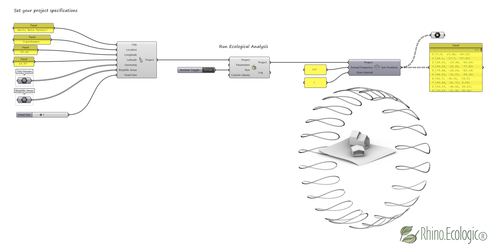 

*Retrieve the annual sun positions of your project as a list of points.* 
 

 

#### 3.6.2   Get Daily Sun Positions 

To obtain the daily sun positions for your project, connect the `Get Daily Sun Positions` Grasshopper component to your analysed Rhino.Ecologic project and define a specific day of the year in serial. The component outputs the daily sun positions for that day as a list of points. 

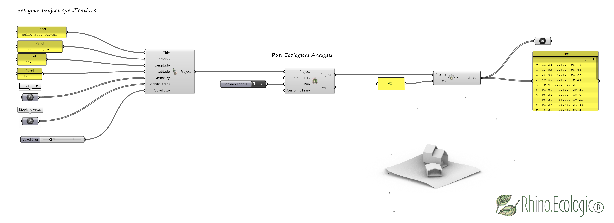 

*Retrieve the daily sun positions of your project as a list of points.* 
 

 

#### 3.6.3   Get Biophilic Voxels 

Once the `Get Biophilic Voxels` component is connected to the analysed project, only voxels located within the biophilic areas are selected.

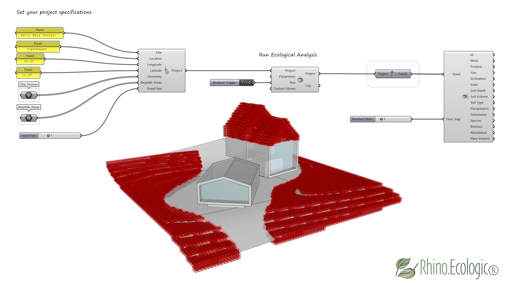 

*Retrieve the biophilic voxels associated with the `Biophilic Area` of your Rhino.Ecologic `Project`.* 
 

 

#### 3.6.4   Get Plant Voxels 

To filter voxels that potentially contain vegetation based on the ecological analysis, use the `Get Plant Voxels` component. This component identifies all voxels that have a valid (positive) biomass value, indicating the presence of plant growth.

As inputs, connect the analysed Rhino.Ecologic project and specify the time step (in years) for which you want to retrieve the data. The output consists of all voxels within the complete voxel graph that contain a positive biomass value at the selected time step.

Using this component in your definition allows you to simulate the growth of plant species over time and to visualise vegetation including herbs, shrubs, and trees as *true 3D voxel representations*. 

 

*The `Get Plant Voxels` component enables time-based plant growth simulations for your `Project`.* 
 

 

#### 3.6.5  Get Voxels By Type 

The `Get Voxels by Type` component filters the voxel graph by a specific voxel type, such as `Exterior`, `Exterior Envelope`, `Interior Envelope`, or `Interior`. By connecting the analysed Rhino.Ecologic project and a `Value List`, you can select the desired voxel type.

- The `Exterior` voxel graph contains all voxels at the defined resolution that lie within the bounding box surrounding your 3D project.
- The `Exterior Envelope` voxel graph includes all voxel cells that form the outer envelope of your 3D model, including both terrain and building geometry.
- The `Interior Envelope` voxel graph represents the voxel cells located on the inner surfaces of enclosed spaces.
- The `Interior` voxel graph contains all voxels located fully within a closed volume of you 3D model. 

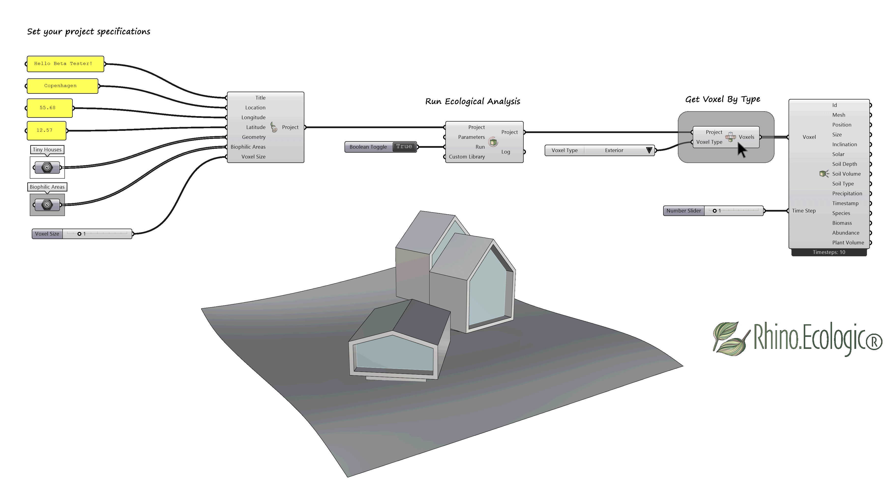 

*Retrieve a specific voxel type from your project. In the example shown, the `Exterior` voxel graph contains a total of 247,016 voxels, while the `Exterior Envelope` voxel graph contains 22,209 voxels.*
 

 

#### 3.6.6   Get Soil Description 

Rhino.Ecologic uses 10 functionally distinct `Soil Types` to capture the key ecological properties influencing vegetation, water dynamics, and biodiversity, while avoiding unnecessary taxonomic complexity and ensuring efficient, robust simulations.
To support a clearer understanding of these `Soil Types`, the `Get Soil Description` component provides expert information for each of the soil categories used in Rhino.Ecologic: `Clay`, `Loamy Sand`, `Sandy Loam`, `Loam`, `Silt Loam`, `Silt`, `Sandy Clay Loam`, `Silty Clay Loam`, `Sandy Clay`, and `Silty Clay`. 

 

- **Clay:** Very heavy soil with high water and nutrient capacity, but no aeration and strong penetration resistance. Relatively rare. *Examples: lake sediments or quiet zones of river deltas (locally), heavily disturbed sites with exposed subsoil; contaminated brownfields (functionally equivalent).*
  
- **Loamy Sand:** Sand-dominated soil with some loam; higher nutrient and water-holding capacity than pure sand. *Examples: heathlands, dry pine forests.*
  
- **Sandy Loam:** Loam-dominated soil with a higher sand content; good aeration and drainage but lower nutrient retention than loam. *Examples: sandy riverbanks, vineyard soils in warm climates, intensive green roofs.*
  
- **Loam:** Balanced soil with a mix of sand, silt, and clay, providing good aeration, drainage, and water and nutrient retention. Easy for roots to penetrate. *Examples: gardens and parks, productive farmland.*
  
- **Silt Loam:** Silt-dominated, fine-textured soil with good drainage and high water and nutrient retention, but prone to erosion. *Examples: fertile agricultural plains, loess soils, river deltas.*
  
- **Silt:** Fine but non-cohesive soil with high water retention and nutrient accessibility, but prone to erosion. Rare in pure form. *Examples: exposed subsoils and river bank sediments in loess regions (e.g. Danube loess belt).*
  
- **Clay Loam:** Clay-rich soil with high water and nutrient retention, but prone to compaction and difficult root penetration. Poor drainage and stagnant water may limit plant growth. *Examples: heavily irrigated farmland, muddy pastures.*
  
- **Sandy Clay Loam:** Substantial clay content but enough sand to improve aeration and drainage compared to clay loam. High nutrient retention but moderate penetration resistance. *Examples: Old agricultural soils on sandy substrates, mixed alluvial deposits; some urban soils.*
  
- **Silty Clay Loam:** Fine-textured soil with high water and nutrient retention but reduced drainage, intermediate between loam and clay loam. *Examples: floodplains, fertile valley soils, brownfields and other compacted vacant lots.*
  
- **Sandy Clay:** Clay-dominated soil with noticeable sand fraction; very high nutrient and water capacity, but still poosr drainage and accessibility. *Examples: disturbed industry/construction sites.*
  
- **Silty Clay:** Very fine-textured, cohesive and with extremely high water/nutrient retention. Minimal aeration, high penetration resistance. Often seasonally waterlogged. *Examples: backswamps, lake margins.*
The class NoSoil describes the absence of any substrate that supports growth. 

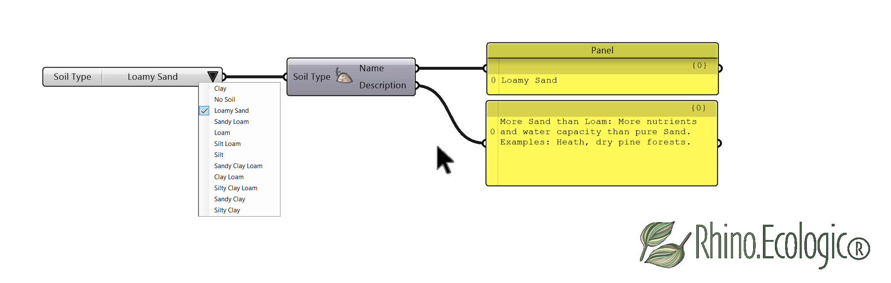 

*Get more information about the various `Soil Types` used in the ecological analysis by connecting a `Panel` to the `Description` output.* 
 

 

#### 3.6.7 Utilities tab Inputs 

The table provides information about the `Type`, `Access`, and `Units` for each input in the **Utilities tab**. 

| Input| Label (GH)            | Type                | Access     | Units             | Description            | 
|:------:|-----------------------|---------------------|------------|-------------------|-------------------|
| `Project`  | `P`       | `Parameter`             | `Item`      | `N/A` | The Rhino.Ecologic project to derrive sun positions from/ The Rhino.Ecologic project containng voxels.
| `Annual Frequency`  | `F`       | `Integer`             | `Item`      | `N/A` | The count of days to sample across the year.
| `Hour Interval`  | `H`       | `Integer`             | `Item`      | `Hours` | The interval between hours of the day to sample.
| `Day`  | `D`       | `Integer`             | `Item`      | `Day` | Day of the yeaar in serial.
| `Time Step`  | `TS`       | `Integer`             | `Item`      | `N/A` | The time step to evaluate voxels at.
|  `Voxel`  | `V`       | `Parmeter`             | `Item`      | `N/A` | The voxel to get the value from.
| `Analysis Type`  | `AT`       | `Integer`             | `Item`      | `N/A` | Attribute to set (connect a default value list for available options).
| `Voxel Type`  | `VT`       | `Integer`             | `Item`      | `N/A` | Voxel Type of voxel to get (connect a default value list for available options).
| `Soil Type`  |`ST`       | `Text`        | `List`      | `N/A`          | The soil type to get the description of.

 

#### 3.6.8 Utilities tab Outputs 

The table summarizes the `Type`, `Access`, and `Units` for each output in the **Utilities tab**. 

| Output | Label (GH)            | Type                | Access     | Units             | Description |
|:------:|-----------------------|---------------------|------------|-------------------|-------------|
| `Sun Positions`  | `SP`       | `Point`             | `List`      | `N/A` | The sun positions as points.
|  `Voxels`  | `V`       | `Parmeter`             | `Item`      | `N/A` | The resulting voxels.
|  `Voxels`  | `V`       | `Voxel`             | `List`      | `N/A` | The voxels containing valid plant data.
| `Time Step`  | `TS`       | `Number`             | `Item`      | `N/A` | The time step the voxels were evaluated at.
| `Name`  | `N`       | `Text`             | `List`      | `N/A` | The soil type's name.
| `Description`  | `D`       | `Text`             | `List`      | `N/A` | The soil type's description.

 

> 💡 **Tip:** To repeat this exercise using your own setup, you can use the Tutorial template 🦗 Grasshopper files ***Rhino.Ecologic_Growth_Simulation.gh*** and ***Rhino.Ecologic_Sun_Positions.gh***, and the 🦏 Rhino 3D model example file ***Rhino.Ecologic_Example_Wood_Cabins.3dm***, which are available by hovering over the **Rhino.Ecologic tab** at the top of the Grasshopper menu. 

 

### 3.7 Statistics tab 

The **Statistics** components provide supporting tools for performing descriptive analyses of different project attributes by returning summary statistics of the project data. 

The **Statistics tab** is positioned alongside the **Utilities tab** and contains the following Grasshopper components: `Get Biodiversity Summaries`, `Get Inclination Summaries`, `Get Precipitation Summaries`, `Get Soil Summaries`, `Get Solar Summaries`, and `Get Voxel Summaries`. 

 

The table below provides an overview of the Grasshopper components available in the **Statistics tab**. 

| GH Icon    | Feature | Category/ Subcategory | Description |Input parameters |Output|
|--------- |------------------------------|---------------|---------------|------------------------------|------------------------------|
|    |  *Get Biodiversity Summaries (BS)* | Rhino.Ecologic®/ Statistics | Performs descriptive analysis on the biodiversity attributes of a project and returns its summary statistics. |Project|Minimum, Maximum, Average, Median|
|      |  *Get Inclination Summaries (IS)* | Rhino.Ecologic®/ Statistics | Performs descriptive analysis on the inclination attributes of a project and returns its summary statistics. |Project | Minimum, Maximum, Average, Median|
|      |  *Get Precipitation Summaries (PS)* | Rhino.Ecologic®/ Statistics | Performs descriptive analysis on the preciptitaion attributes of a project and returns its summary statistics. |Project | Minimum, Maximum, Average, Median|
|      |  *Get Soil Summaries (SS)* | Rhino.Ecologic®/ Statistics | Performs descriptive analysis on the soil attributes of a project and returns its summary statistics. |Project | Minimum Soil Depth, Maximum Soil Depth, Average Soil Depth, Median Soil Depth, Minimum Soil Volume, Maximum Soil Volume, Average Soil Volume, Median Soil Volume, Soil Type Distribution (Types), Soil Type Distribution (Count) |
|      |  *Get Solar Summaries (SS)* | Rhino.Ecologic®/ Statistics | Performs descriptive analysis on the solar attributes of a project and returns its summary statistics. |Project | Minimum Soil Depth, Maximum, Average, Median|
|      |  *Get Voxel Summaries (VS)* | Rhino.Ecologic®/ Statistics | Performs descriptive analysis on the voxel attributes of a project and returns its summary statistics. |Project | Biophilic Areas Count, Type Distribution (Types), Type Distribution (Count), Voxel Index, Degree Centrality|

 

#### 3.7.1 Get Summaries components 

The **Get Summaries** components provide descriptive analyses of analysis results that can be used for project statistics. To get started, use your analyzed Rhino.Ecologic project as input, and generate statistical summaries for `Biodiversity`, `Inclination`, `Soil`, `Solar`, and `Voxel` attributes. 

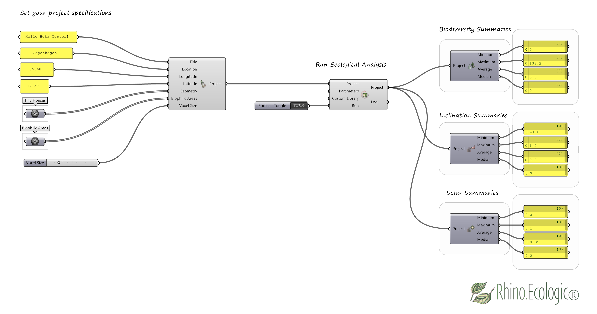 

*Obtain statistical summaries such as `Biodiversity`, `Inclination`, and `Solar` summaries for your Rhino.Ecologic project.* 
  
                                                                                                                 

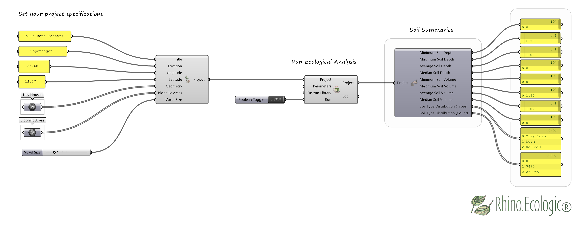 

*Obtain statistical summaries for `Soil` (`Soil Depth`, `Soil Volume`, and `Soil Type`) in your Rhino.Ecologic project. In addition, the component provides a list of all soil types used in the analysis, along with the count for each soil type.* 
  

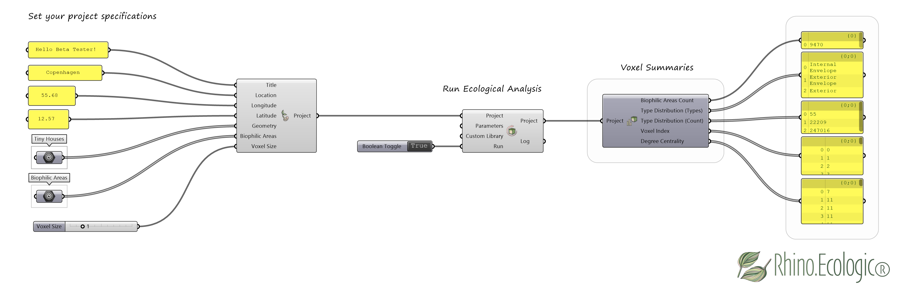 

*Obtain `Voxel` statistical summaries for your Rhino.Ecologic project. These include the count of biophilic voxels, information on voxel type distribution, voxel identifiers, and the calculated degree for each voxel node.* 
 
 

#### 3.7.2 Statistics tab Inputs 

The table below shows the input for the **Statistics** components (= analysed Rhino.Ecologic Project). 

| Input| Label (GH)            | Type                | Access     | Units             | Description            | 
|:------:|-----------------------|---------------------|------------|-------------------|-------------------|
| `Project`  | `P`       | `Parameter`             | `Item`      | `N/A` | The Rhino.Ecologic project containing the voxels.  
 

#### 2.7.3 Statistics tab Outputs 

The table below summarizes all output parameters such as `Minimum`, `Maximum`, `Average`, and `Median` values of project attributes. 

| Output | Label (GH)            | Type                | Access     | Units             | Description |
|:------:|-----------------------|---------------------|------------|-------------------|-------------|
| `Minimum`  |`Min`       |`Number`             | `Item`      | `N/A`          |Minimum of the value in the voxels. 
| `Maximum`  |`Max`        | `Number`             | `Item`      | `N/A`         |Maximum of the value in the voxels. 
| `Average`  |`Avg`        |`Number`             | `Item`      | `N/A`        |Average of the value in the voxels. 
| `Median`  |`M`       | `Number`             | `Item`      | `N/A`         |Median of the value in the voxels. 
| `Minimum Soil Depth`  |`Min SD`       | `Number`             | `Item`      | `Model unit`         |Minimum value of soil depth analysis. 
| `Maximim Soil Depth`  |`Max SD`       | `Number`             | `Item`      | `Model unit`         |Maximum value of soil depth analysis. 
| `Average Soil Depth`  |`Avg SD`       | `Number`             | `Item`      | `Model unit`        |Average value of soil depth analysis.
| `Median Soil Depth`  |`M SD`       | `Number`             | `Item`      | `Model unit`         |Median value of soil depth analysis.
| `Minimum Soil Volume`  |`Min SV`       | `Number`             | `Item`      | `Model unit`         |Minimum value of soil volume analysis. 
| `Maximum Soil Volume` |`Max SV`       | `Number`             | `Item`      | `Model unit`         |Maximum value of soil volume analysis.
| `Average Soil Volume`  |`Avg SV`       | `Number`             | `Item`      | `Model unit`         |Average value of soil volume analysis.
| `Median Soil Volume`  |`M SV`       | `Number`             | `Item`      | `Model unit`        |Median value of soil volume analysis.
| `Soil Type Distribution (Types)`  |`STT`       | `Text`             | `List`      | `N/A`         |Soil types of soil distribution.  
| `Soil Type Distribution (Count)`  |`STC`       | `Integer`             | `List`      | `N/A`         |Soil type count of soil distribution.  
| `Biophilic Areas Count`  |`M`       | `Integer`             | `Item`      | `N/A`         |The count of biophilic voxels.  
| `Type Distribution (Types)`  |`M`       | `Text`             | `List`      | `N/A`         |Voxel types of voxel distribution.  
| `Type Distribution (Count)`  |`M`       | `Integer`             | `List`      | `N/A`         |Voxel count of voxel distibution.
| `Voxel Index`  |`M`       | `Integer`             | `List`      | `N/A`         |The voxel's identifier.  
| `Degree Centrality`  |`M`       | `Number`             | `List`      | `N/A`         |Calculated degree for each node.  
 

> 💡 **Tip:** To repeat this exercise using your own setup, you can use the Tutorial template 🦗 Grasshopper files ***Rhino.Ecologic_Statistics.gh***, and the 🦏 Rhino 3D model example file ***Rhino.Ecologic_Example_Wood_Cabins.3dm***, which are available by hovering over the **Rhino.Ecologic tab** at the top of the Grasshopper menu. 

  

### 3.8 Species Library tab 

Ecological analyses are strongly influenced by site-specific and geographic conditions, and species composition may vary significantly between different urban ecosystems. As a result, working with a project-specific, custom species library can be advantageous.

The **Species Library** components provide tools for defining and managing custom species for ecological analysis. Species can be parameterized using individual traits such as life span, maturation time, and rooting depth and organized into user-defined Custom Libraries.

Custom species libraries can be exported and reused as references in other projects. Both individual species definitions and complete species libraries can be decomposed to inspect and access their underlying parameters.

The **Species Library** components also support the creation of **Soil Sets**, which define collections of soil types and parameterize soil conditions relevant to plant growth.

The **Species Library** tab is located next to the **Statistics** tab at the outer edge of the menu and includes the following Grasshopper components: `Compute Preset Values`, `Create Plant`, `Create Plant Library`, `Create Soil Set`, `Deconstruct Plant`, `Deconstruct Plant Library`, `Deconstruct Soil Set `, `Import Plant Library`, and `Save Plant Library`. The functionality of each of these components is described below. 

 

The table below provides an overview of the Grasshopper components available in the **Species Library**. 

| GH Icon    | Feature | Category/ Subcategory | Description |Input parameters |Output|
|--------- |------------------------------|---------------|---------------|------------------------------|------------------------------|
|    |  *Compute Preset Values (CPV)* | Rhino.Ecologic®/ Species Library | Provides reasonable guesses for traits that are difficult to find in literature.  |Life Span, Growth Form, Shade Tolerance |Maturation Time, Rooting Depth, Size, Germiantion Rate, Shade Tolerance|
|      |  *Create Plant (CPL)* | Rhino.Ecologic®/ Species Library  | Creates a plant definition. |Name, Growth Form, Life Span, Maturation Time, Shade Tolerance, Shape, Max Height, Width, Opacity, Ratio Crown To Stp, Crown Width, Rooting Depth, Size, Soil Set, Germination Rate| Plant|
|      |  *Create Plant Library (CPLL)* | Rhino.Ecologic®/ Species Library  | Creates a plant library provided a series of plant definitions. |Name, Plants| Plant Library|
|      |  *Create Soil Set (CSS)* | Rhino.Ecologic®/ Species Library  | Creates a soil set for a plant definition. |Accepted Soils| Soil Set|
|      |  *Deconstruct Plant (DPL)* | Rhino.Ecologic®/ Species Library  | Deconstructs a plant to its consituent parts. |Plant | Name, Max Height, Life Span, Maturation Time, Rooting Depth, Size, Soil Set, Dormancy, Dormancy Break Rate, Germination Success, Max Biomass, Leaf Surface Area, Biomass Allocation, Seed Allocation, Conversion Efficiency, Opacity, Maintenance Costs |
|      |  *Deconstruct Plant Library (DPLL)* | Rhino.Ecologic®/ Species Library  | Soils contained in the soil set. |Project Data| Graph Display|
|      |  *Deconstruct Soil Set (DSS)* | Rhino.Ecologic®/ Species Library  | Visualizes graphs in the form of a bitmap or svg. |Soil Set| Soils|
|      |  *Import Plant Library (EPLL)* | Rhino.Ecologic®/ Species Library  | Imports a plant library. |Library Path| Plant Library|
|      |  *Save Plant Library (SPLL)* | Rhino.Ecologic®/ Species Library  | Saves a plant library to a file. |Plant Library, Save Directory, Save| - |
 

#### 3.8.1  Compute Preset Values 

Plant species are defined by a set of traits, and for non-ecologists it can be challenging to specify all parameters required for an ecological analysis. 
The `Compute Preset Values` component provides a guided starting point for species definition as it provides a series of preset values to choose from such as `Growth Form` (Grass, Herb, Shrub, Tree Decididuous, Tree Evergreen), and `Shade Tolerance` (Low, Medium, High). The component outputs corresponding values for parameters including `Maturation Time`, `Rooting Depth`, `Plant Size`, `Germination Rate` and `Shade Tolerance` (as numeric value), which can be adjusted if needed.

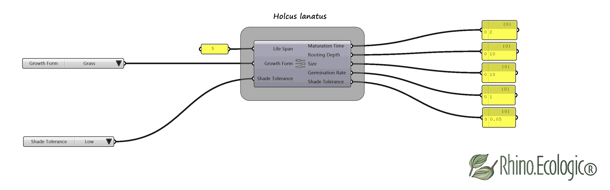 

*The `Compute Preset Values` component calculates values for a plant defintion provided presents.* 
 
 

#### 3.8.2  Create Plant 

A Plant is a Rhino.Ecologic data type provided as a parameter component, located on the far left of the first tab under Parameters. 
Creating a Plant definition requires specifying a set of traits that describe the species. The Plant data type acts as a container for this information. 
You will need to input the following parameters: `Name`, `Growth Form`, `Life Span`, `Maturation Time`, `Shade Tolerance`, `Shape`, `Max Height`, `Width`, `Opacity`, `Ratio Crown to Stem,` `Crown Width`, `Rooting Depth`, `Size`, `Soil Set`, and `Germination Rate`.
These parameters are used to infer further ecological/physiological characteristics of the plant automatically. See also `Deconstruct Plant` component  
 

> 💡 **Tip:** To simplify the definition process, the `Compute Preset Values component` described above can be used to generate initial parameter values.
Many plant traits can be obtained from publicly available sources, such as botanical databases and general reference resources (for example, Wikipedia).  

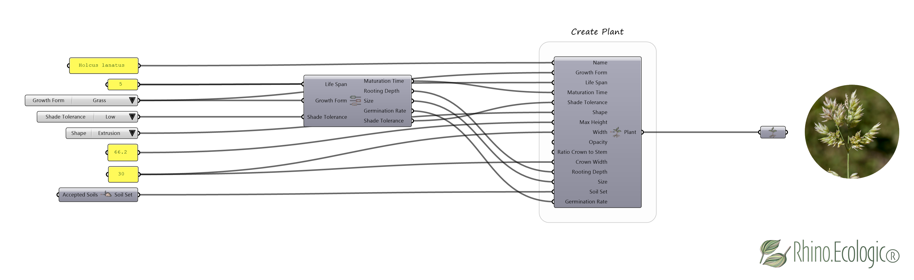 

*In this example, the plant *Holcus lanatus* (Yorkshire fog) is created.* 
 

#### 3.8.3  Create Plant Library 

To define a list of plant species for a study site, create a `Plant Library` that contains the plant species relevant to your project.
First, parameterize each `Plant` individually by defining its required traits. Once the individual plant definitions are complete, combine them into a library by providing a library `Name` and the list of `Plants`.
The resulting output is a `Plant Library`, a Rhino.Ecologic data type that can be used as input for subsequent ecological analysis components.  

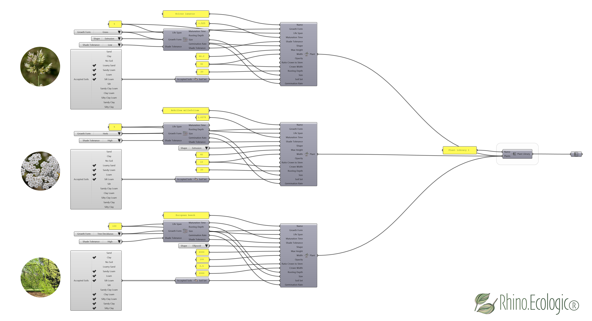 

*The `Create Plant Library` component provides a series of plant definitions.* 
 

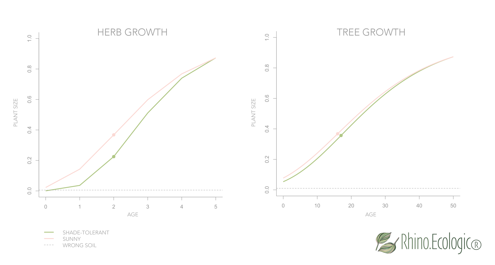 

*The graph illustrates the relationship between plant size and plant age for both herbs and trees.* 
 

#### 3.8.4  Create Soil Set 

Each `Plant` supports a specific set of soil types, which are a prerequisite for successful plant growth. For this reason, the soil types supported by a species must be defined by the user.
The `Create Soil Set` component provides a predefined list of soil types from which users can select all soil types compatible with a given `Plant`. 

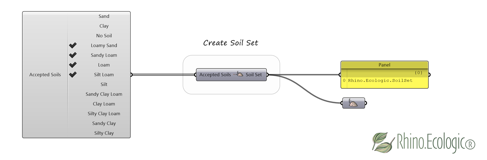 

*The `Accepted Soils` input defines the soil types supported by the plant. The component outputs a list of the selected soil types as a `Soil Set`.* 
 
 

#### 3.8.5  Deconstruct Plant 

If you import a `Plant` data type from a previous project and want to review the traits that define the `Plant`, use the `Deconstruct Plant` component. This component breaks a `Plant` into its constituent parameters, allowing you to inspect and understand its individual traits.
The outputs are: `Name`, `Max Height`, `Life Span`, `Maturation Time`, `Rooting Depth`, `Size`, `Soil Set`, `Dormancy`, `Dormancy Break Rate`, `Germination Success`, `Max Biomass`, `SLA`, `Biomass Allocation`, `Seed Allocation`, `Conversion Efficiency`, `Opacity`, and `Maintance Costs`.

 
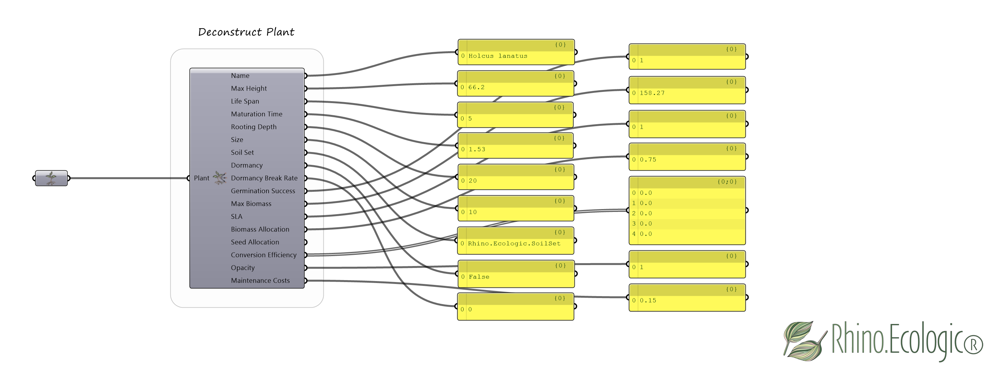 

*The `Deconstruct Plant` component deconstructs a plant to its consituent parts.* 
 
 

#### 3.8.6  Deconstruct Plant Library 

Like the `Plant` data type, a `Plant Library` can be deconstructed into its individual parts. Using the `Deconstruct Plant Library` component, the outputs include the library `Name` and the list of contained `Plant Names`.

 
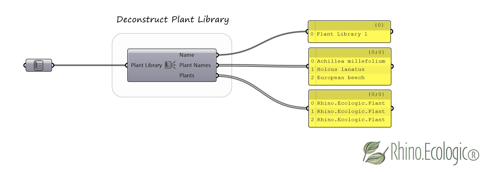 

*The example shows a `Plant Library` after it has been deconstructed using the `Deconstruct Plant Library` component.* 
 
 

#### 3.8.7  Deconstruct Soil Set 

Use the `Deconstruct Soil Set` component to deconstruct a given `Soil Set`.

  
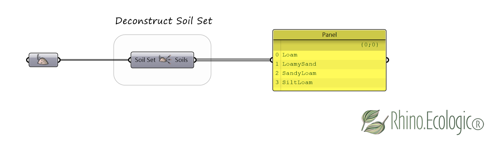 

*The output is a list of soil types accepted by a specific `Plant`.* 
 
 

#### 3.8.8  Import Plant Library 

Use the `Import Plant Library` component to import a custom `Plant Library`.

  
 

*Import fo a Plant Library.* 
 
 

#### 3.8.9  Save Plant Library 

Use the `Save Plant Library` component to save your custom `Plant Library`.

   
 

*Save your custom Plant Library.* 
 
 

#### 3.8.10 Species Library Inputs 

The table below shows the input for the **Species Library** components. 

| Input| Label (GH)            | Type                | Access     | Units             | Description            | 
|:------:|-----------------------|---------------------|------------|-------------------|-------------------|
| `Life Span`  | `LS`       | `Integer`             | `Item`      | `Years`  | Life span of the plant in years.   
| `Growth Form`  | `GF`       | `Integer`              | `Item`      | `(0) Grass`, `(1) Herb`, `(2) Shrub`,`(3) Tree Deciduous`, `(4) Tree Evergreen`| Growth form of the plant (grass, herb, shrub, deciduous or evergreen tree). (Connect a default value list for available option).   
| `Shade Tolerance`  | `ST`       | `Integer`            | `Item`       | `(0) Low`, `(1) Medium`, `(2) High`  | Shade tolerance (low, medium, high). (Connect a default value list for available options).   
| `Name`  | `N`       | `Text`             | `Item`      | `N/A` | Plant name. 
| `Maturation Time`  |`MT`       | `Number`    | `Item`      | `Years`    | Years until seed production.   
|  `Shade Tolerance`  |`ST`       | `Number`             | `Item`      | `Percentage`  | Shade tolerance in %.  
| `Shape`  | `SA`       | `Integer`             | `Item`      | `(0) Extrusion`, `(1) Ellipsoid`, `(2) Cone` | General shape of a plant. (Connect a default value list for available options).    
| `Max Height`  | `Max H`       | `Number`             | `Item`      | `Centimeters (cm)` | Maximum height of the plant in centimeters (cm), not counting flower stalks.   
| `Width`  | `W`       | `Number`             | `Item`      | `Centimeters (cm)` | For trees: Diameter of the tree stem at breast height in cm; For Shrubs: sum of diameters of all major branches in cm; For Herbs: Diameter of the grass tussock in cm, or width of herb at its broadest point ("bounding box") without the rosette.   
| `Opacity`  | `O`       | `Number`             | `Item`      |`Percentage` | Percentage of leaf area to shade cast (glossy or strangely oriented leaves may cast less shade than one would expect from their form).   
| `Ratio Crown to Stem`  | `RCS`       | `Number`    | `Item`  | `Percentage` | Percentage of tree crown on total Height
| `Crown Width`  | `CW`       | `Number`    | `Item`      | `Centimeters (cm)` | For trees/shrubs: diameter of the crown (cm); For grasses/herbs: equal to `Width` parameter. 
| `Rooting Depth`  |`RD`       | `Number`    | `Item`      | `Centimeters (cm)` | Minimal required soil depth for fully grown plants, in centimeters (cm).  
| `Size`  |`S`      | `Integer`   | `Item`    | `Model units, range 1-100` | Relative plant size, describing how much soil space the plant occupies (1-100).   
| `Soil Set`  | `S`       | `Parameter`             | `Item`      | `N/A` | Represents a set of soils that can provide a nurturing environment for a plant.  
| `Germination Rate`  |`GR`      | `Number`             | `Item`      | `Percentage`   |Germination probability as percentage. It only considers active seeds.
|`Name`  | `N`       | `Text`             | `Item`      | `N/A` | Name of the plant library. 
|`Plants`  | `P`       | `Parameter`             | `List`      | `N/A` | Plants to compose a library from. 
|`Accepted Soils`  | `AS`       | `Integer`             | `List`      | `(0) Sand`, `(1) Clay`, `(2) No Soil`, `(3) Loamy Sand`, `(4) Sandy Loam`, `(5) Loam`, `(6) Silt Loam`, `(7) Sandy Clay Loam`, `(8) Clay Loam`, `(9) Silty Clay Loam`, `(10) Sandy Clay`, `(11) Silty Clay ` | Soil types this plant accepts. (Connect a default value list for available options). 
|`Library Path`  | `LP`       | `Text`             | `Item`      | `N/A` | The path to lplant library folder. 
|`Plants`  | `PL`       | `Parameter`             | `Item`      | `N/A` | Plant to deconstruct. 
| `Plant Library`  | `PLL`       | `Parameter`             | `Item`      | `N/A` | Plant library to deconstruct. 
 

#### 3.8.11 Species Library Outputs 

The table below summarizes the output parameters in the **Species Library** components. 

| Output | Label (GH)            | Type                | Access     | Units             | Description |
|:------:|-----------------------|---------------------|------------|-------------------|-------------|
| `Maturation Time`  |`MT`       | `Number`    | `Item`      | `Years`    |Years until seed production. 
| `Rooting Depth`  |`RD`       | `Number`    | `Item`      | `Centimeters (cm)`    | Minimal required soil depth for fully grown plants, in centimeters (cm).
| `Size`  |`S`      | `Integer`   | `Item`    | `Model units, range 1-100`  |Relative plant size, describing how much soil space the plant occupies (1-100). 
| `Germination Rate`  |`G`      | `Number`             | `Item`      | `Percentage`   |Germination probability as percentage. Affects number of individual that will establish on site.
| `Shade Tolerance`  |`ST`       | `Number`             | `Item`      | `Percentage`   |Shade tolerance, a relative estimate as a percentage. 
| `Plant`  | `PL`       | `Parameter`             | `Item`      | `N/A` | A description of a plant.   
| `Plant Library`  | `PLL`       | `Parameter`             | `Item`      | `N/A` | The plant library composed using the plants. A descrition of a Plant Library.   
| `Soil Set`  | `S`       | `Parameter`             | `Item`      | `N/A` | Represents a set of soils that can provide a nurturing environment for a plant.  
| `Name`  | `N`       | `Text`             | `Item`      | `N/A` | Plant name.  
| `Max Height`  | `Max H`       | `Number`             | `Item`      | `Centimeters (cm)` | Maximum height of the plant in centimeters (cm).    
| `Life Span`  | `LS`       | `Integer`             | `Item`      | `Years`  | Life span of the plant in years.  
| `Maturation Time`  |`MT`       | `Number`    | `Item`      | `Years`    | Years until seed production.  
| `Rooting Depth`  |`RD`       | `Number`    | `Item`      | `Centimeters (cm)` | Maximum rooting depth in centimeters (cm).  
| `Size`  |`S`      | `Integer`   | `Item`    | `Model units, range 1-100` | Relative plant size, describing how much soil space the plant occupies (1-100). 
| `Soil Set`  | `S`       | `Parameter`             | `Item`      | `N/A` | Represents a set of soils that can provide a nurturing environment for a plant.  
| `Dormancy`  | `D`       | `Boolean` | `Item`      | `True/False` | Describes whether a seed bank exists.  
| `Dormancy Break Rate`  | `DBR`       | `Number`    | `Item`       | `Percentage` | Percentage of seeds that break dormacy and are pushed back into active state every time step (High rate = short lived seed bank). 
| `Germination Success`  | `GS`       | `Number`    | `Item`       | `Percentage` | Probability of germination as percentage.  
| `Max Biomass`  | `Max BM`       | `Number`    | `Item`  | `g` | Maximum biomass of the plant in g
| `Surface Leaf Area`  | `SLA`       | `Number`    | `Item`      | `cm²/g` | Leaf surface area per g biomass .  
| `Biomass Allocation`  | `BMA`       | `Number`    | `Item`  | `Percentage` | Percentage of resources allocated into green leaf growth annually after accounting for maintenance costs.  
| `Seed Allocation`  | `SA`       | `Number`    | `Item`  | `Percentage` | Percentage of resources allocated into seed prpduction annually after accounting for maintenance costs.  
| `Conversion Efficiency`  | `CE`       | `Number`    | `Item`     | `g/kJ (annual light energy)` | Base conversion efficiency of light to sucrose, expressed in g sucrose per kJ of annual light energy.
| `Opacity`  | `O`       | `Number`             | `Item`      | `Percentage` | Percentage of leaf area to shade cast (glossy or strangely oriented leaves may cast less shade than one would expect from their form)
| `Maintenance Costs`  | `MC`       | `Number`             | `Item`    | `g sucrose / (g biomass * year)` | Annual maintenance costs in g sucrose per g biomass, including respiration, leaf replacement, and other metabolic costs.   
| `Name`  | `N`       | `Text`             | `Item`      | `N/A` | Name of the plant library.
| `Plant Names`  | `PLN`       | `Text`             | `List`      | `N/A` | Names of the plants contained in the plant library.
| `Plants`  | `PL`       | `Parameter`             | `List`      | `N/A` | Plants contained in the plant library.  
| `Save Directory`  | `D`       | `Text`             | `item`      | `N/A` | A directory to save the serialized project to.  
 
 

> 💡 **Tip:** To repeat this exercise using your own setup, you can use the Tutorial template 🦗 Grasshopper files ***Rhino.Ecologic_Species_Library.gh***, and the 🦏 Rhino 3D model example file ***Rhino.Ecologic_Example_Wood_Cabins.3dm***, which are available by hovering over the **Rhino.Ecologic tab** at the top of the Grasshopper menu. 
 

### 3.9 Troubleshooting 

This section outlines common warnings and errors you may encounter, along with recommended fixes to help you resolve them quickly. 

| **Issue**              | **Solution**                                                                 |
|------------------------|------------------------------------------------------------------------------|
| Toolbar does not appear | Ensure `.gha` file is unblocked (Right-click → Properties → check “Unblock”) |
| Errors on load          | Update Rhino to the latest stable version and restart your system            |
|Error message DLL NOT FOUND         | ENSURE BOTH DLLS ARE PRESENT: BiophiliaAPI.dll and plants.dll must be in the same directory; Your application executable should be in the same directory.   CHECK FILE PROPERTIES: Right-click each DLL -> Properties -> Unblock (if present); Ensure both DLLs have the same architecture (both 32-bit or both 64-bit)   IF PROBLEM PERSISTS: 1. Run this application as Administrator; 2. Temporarily disable antivirus software; 3. Check Windows Event Viewer for additional error details; 4.Copy runtime DLLs to application directory as last resort 

 
 

## Chapter 4: The Ecological Core — The *Joschinski Model* - an individual-based community model 

### 4.1 Conceptual foundation 

Ecological systems are governed by interacting biotic and abiotic processes that operate across multiple spatial and temporal scales. Plant performance depends simultaneously on resource availability (e.g., light), environmental constraints (e.g., temperature, soil chemistry), and interactions with other organisms. These factors do not act independently; rather, they form tightly coupled feedback structures. Such cross-scale interactions render ecological community dynamics inherently nonlinear and difficult to infer from static correlations alone. Mechanistic modeling therefore becomes essential for representing the processes that generate observable vegetation patterns.

At the core of Rhino.Ecologic lies the *Joschinski Model* (Joschinski et al. 2024), a spatially explicit, individual-based ecological simulation model that governs the dynamic behavior of plant communities within the voxelized design space. The model forms the computational backbone of the ecological analysis pipeline. It is neither a statistical black box nor a correlative predictor; rather, it is a mechanistic, rule-based system that simulates ecological processes directly on the geometry-derived spatial domain.

The *Joschinski Model* belongs to the class of individual-based community models (IBMs). In this modeling paradigm, each plant is represented as an autonomous individual characterized by species-specific functional traits. Community-level patterns are not imposed externally; instead, they emerge from localized interactions among individuals competing for limited resources under defined environmental constraints. Ecological dynamics unfold across discrete annual time steps, during which germination, growth, biomass allocation, reproduction, dispersal, and mortality are simulated sequentially.

Unlike classical Species Distribution Models (SDMs), which estimate potential species occurrence based on statistical correlations between environmental variables and observation data, the Joschinski Model simulates the ecological processes that generate these patterns. Species dominance, coexistence, and decline arise from competition, trait differences, and spatial structure rather than from fitted probability surfaces.  

### 4.2 Spatial representation and environmental integration 

The spatial domain of the simulation is defined by the voxel graph generated from the project geometry. During initialization, the 3D model is discretized into a structured volumetric grid, where each voxel stores geometric and environmental attributes derived from both design input and geographic location. These include soil depth, soil type, soil volume, solar radiation, and precipitation.

The voxel structure is not merely a storage mechanism; it defines the topology of ecological interaction. Voxels form a connected spatial graph in which plants compete for light and space. Vertical subdivision into substrata increases the resolution of light competition and enables shading to be calculated with spatial fidelity. This discretized representation allows the model to resolve three-dimensional competition while maintaining computational efficiency.

Environmental parameters influence plant performance locally. Solar input is computed per voxel and intercepted according to crown geometry and shading relationships. Soil constraints regulate establishment and survival based on rooting depth and soil compatibility. In this way, environmental data derived from the design model directly influence ecological trajectories. 
 

### 4.3 Plant representation and trait-based dynamics 

Each plant individual is defined through a trait-based parametrization. These traits include life span, growth form, maximum height, crown geometry, rooting depth, shade tolerance, biomass allocation strategy, and energetic conversion efficiency. Rather than representing vegetation abstractly, the model assigns each plant an explicit geometric envelope that determines how it intercepts light and casts shade on neighboring individuals.

Growth follows species-specific trajectories under ideal conditions. However, actual development is contingent on resource availability. Light functions as the primary limiting factor in the system. Intercepted energy is converted into biomass according to species-specific efficiencies, after which maintenance costs are subtracted. Remaining resources are allocated to structural growth and reproduction. Under competitive shading, biomass production declines, growth slows, and mortality risk increases.

Competition is therefore not imposed as a ranking mechanism but emerges from spatial overlap and energy limitation. As crowns expand and overlap, light distribution becomes heterogeneous. Taller or more shade-tolerant individuals may gain competitive advantage, while suppressed individuals may stagnate or die. Community structure thus develops dynamically from local interactions. 

 

*The "Joschinski Model", a spatial temporal individual-based community model. This model tracks multiple individuals from multiple species through their life cycles. ©McNeel Europe 2025.*    
  

### 4.4 Succession, stochasticity, and emergence 

Successional dynamics arise from differences in life-history strategies. Fast-growing, short-lived species may dominate early stages when light is abundant, while slower-growing but taller or more shade-tolerant species gradually shape canopy structure over time. Soil constraints and dispersal processes further regulate species composition.

The model incorporates stochasticity in processes such as seed dispersal, germination success, and competitive light allocation. As a result, repeated simulation runs with identical inputs may yield numerically different outcomes. This variability reflects ecological realism rather than computational instability. Outputs should therefore be interpreted as probabilistic trajectories or pattern tendencies rather than deterministic predictions. For reproducibility and debugging, a fixed random seed can be activated. 

Plant growth in the model is influenced by several key factors:  

| GH graph    | Description|
|--------- |------------------------------|
| 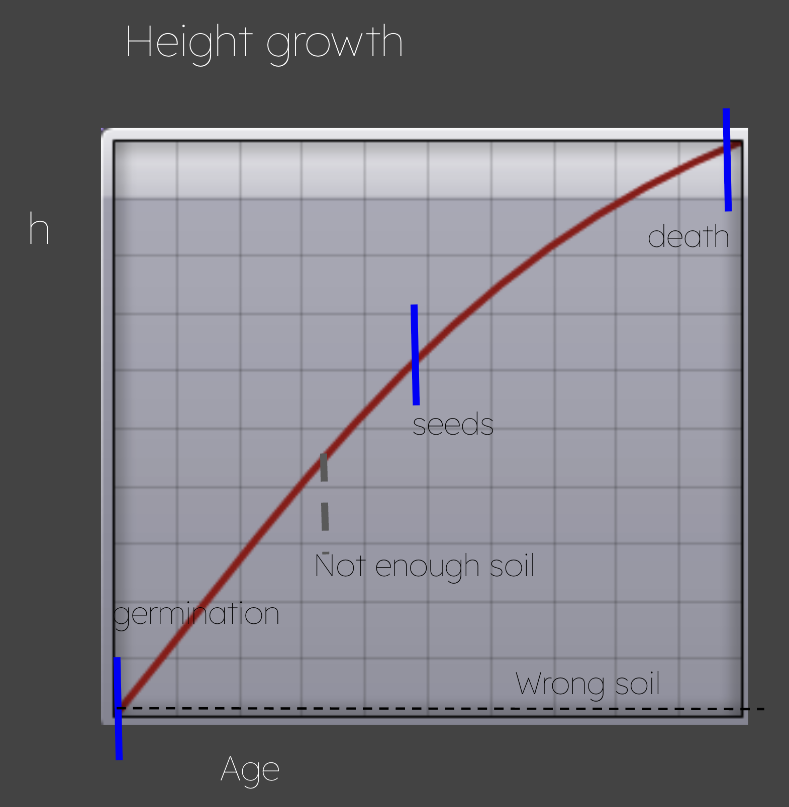    |  *The graph displays growth in height over time. The curve is species-specific and remains fixed—it does not respond to environmental conditions. Each species follows its own predefined growth trajectory.*
| 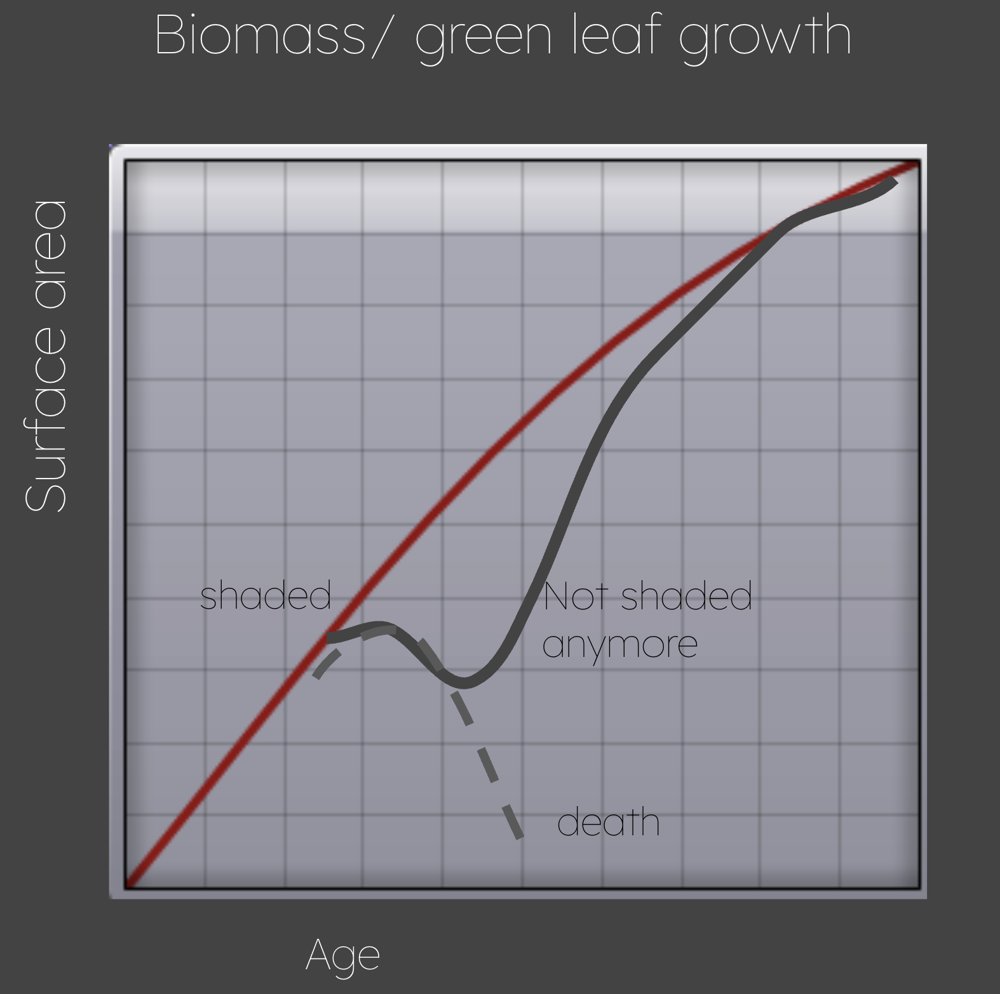    | *The graph displays biomass accumulation, specifically green leaf growth. Under ideal conditions, this growth follows a curve similar to that of height development.*  

However, if a plant is shaded by neighboring individuals, its ability to collect energy is reduced. As a result, biomass production slows, the plant falls behind in development, and in extreme cases, may die due to resource limitations.  

### 4.5 Core logic and theory

This section summarises the concepts of the model on a high level only. 

> 💡 **Tip:** For more detailed information, refer to the xx [insert link to ODD]  

The principle agents of the simulation are seeds and plant individuals.The seeds have the following attributes:

- they need space: the soil can accomodate a potentially large, but not infinite number of seeds.
- they live: they can die, or they can be converted into individuals
- they can form seed banks: Seeds produced in autumn may germinate the next year, or they can stay dormant and be buried in the soil for many years.
  
 The individual has the following attributes:
 
 - it needs a place to live: Soil (space) is a limiting resource, and soil determines whether a plant can grow at all.
 - it lives: it grows, reproduces and dies.
 - it is photoautotrophic: it converts light into a (carbohydrate) resource; it lives from these resources and produces green (photosynthetically active) biomass and seeds.
 - it has a shape: with its geometric representation, it is able to cast a shades.
 - it interacts with the environment: Stressors can affect each of the above properties, i.e. cause mortality, deplete resources or affect the soil [not yet implemented].
   
In summary, the model simulates germination and seed dispersal, growth, resource allocation, shading, soil suitability and environmental stress.
Plants must be hit by light to collect energy resources. The amount of intercepted light depends on 1) the amount of solar energy hitting each voxel, and 2) the amount of light that is intercepted by other plants or plant parts. For simplicitly, the model currently calculates the plant material growing above each target voxel and reduces the solar energy proportionately. Future iterations of the model will incorporate angular or diffuse light as well. 

*The table below summarizes the inputs, data types, access modes, units, and descriptions of parameters that are internally calibrated to ensure computational stability and ecological plausibility.* 

| Input| Label (GH)            | Type                | Access     | Units             | Description            | 
|:------:|-----------------------|---------------------|------------|-------------------|-------------------|
| `Save Steps`  | ``       | `Integer`             | `Item`      |   `N/A`    | Specifies how many time steps are exported. Should be divisible by SimD. 
| `Energy`  | ``       | `Integer`             | `Item`      |   <code>KWh m-2 a-1</code>    | Average annual solar energy arriving the site. Plants convert the energy of sun rays into biomass and reproduction. Light is usually a limiting resource, reduced light intensifies competition and may exclude plants with a fast-growth strategy.
| `Strata Number`  | `SN`       | `Integer`             | `Item`      |   `N/A`    | To achieve higher light resolution, each input voxel is split into substrata (in z-direction only). Default is 20 and ensures that light/shading is calculated in 5cm intervals. Warning: Setting a different z-resolutions requires reparametrizing the model manually.
| `Starting Population Size`  | `SPS`       | `Integer`             | `Item`      |   `N/A`    | Initial population size in each cell. Unless a starting population was specified (not available yet), SN individuals of random species and age 0 will be placed in each cell. A value >0 reduces or skips primary succession (slow colonization of the site), but the intense and potentially unrealistic competition may lead to counterintuitive results in the first time steps.
| `Initial Seed Count`  | `ISC`       | `Integer`             | `Item`      |   `N/A`    | Number of seeds to be placed in each cell at the start of the simulation. This is similar to SPS, but accounts for differences in seed mortality among species. The result is more realistic than above (though with similar constraints in the first time steps), but also more stochastic and less predictable.
| `Soil Capacity`  | `SCap`       | `Integer`             | `Item`      |   `N/A`    | Maximum space for plants. Each plant takes one or more "seats" depending on their size (see plant library), and no more seeds will germinate once a voxel is "full". This density regulation limits computational resource use and ensures, e.g. that no two large trees can originate in the same voxel (even if light were not limiting).
| `Seed Rain`  | `SR`       | `Integer`             | `Item`      |   `N/A`    | The dispersal of seeds and germination of new plants is not directly controllable by the (landscape) architect. Every year a certain number of seeds lands in the site, *in addition to the seed material from plants growing on-site*. 
| `Light Factor`  | `LF`       | `Integer`             | `Item`      |   `N/A`    | Under intense competition, random plants are chosen to receive light. This factor determines the number of draws per time step, and thereby the grain of the randomness. 1 = winner takes all, inf = equal distribution among all plants
| `Diffusion`  | `Dif`       | `Number`             | `Item`      |   `N/A`    | Light generally comes from above (90°) and has to pass through voxels. This can cause unrealistic shading and competition, and "diffuse" light that cannot be intercepted partially remedies the unrealistic competition. 
| `Does dispersal`  | `DSP`       | `Boolean`             | `Item`      | `True/False`    | Switches off dispersal, so seeds no longer travel to other voxels. May cause seed material to vanish, useful mostly for debugging.
| `Does Soil Class`  | `SC`       | `Boolean`             | `Item`      | `True/False`    | Any soil type check is circumvented, i.e. all plants can life on any kind of soil.
| `Does Soil Depth`  | `SD`       | `Boolean`             | `Item`      | `True/False`    | Soil depth check is circumvented, i.e. root growth no longer constrained by soil depth.
| `Does Regional Model`  | `RM`       | `Boolean`             | `Item`      | `True/False`    | (possibly ?) no longer in use; may deactivate seed rain.
| `Does Disturbance`  | `Dis`       | `Boolean`             | `Item`      | `True/False`    | not implemented.
| `Fix RNG`  | `RNG`       | `Boolean`             | `Item`      | `True/False`    | The model is stochastic and produces numerically varying results on every run. It is recommended to run the models multiple times to explore the statistical distribution of outcomes. The RNG is responsible for the random events like stochastic seed dispersal (where exactly each seeds lands). Fixing it (set to true) for debugging purposes (!) makes the results or errors reproducible but causes the model to always produce the same result. 

### 4.6 Scale, calibration, and intended use 

The Joschinski Model is calibrated for small to medium spatial scales, typically between 100 and 10,000 m². It is particularly suited to urban design contexts such as green roofs, courtyards, façades, parks, and neighborhood-scale interventions where fine-grained spatial interactions meaningfully affect biodiversity and biomass development.
While advanced parameters are exposed for expert use, most ecological constants are internally calibrated to ensure stability and ecological plausibility. Designers are encouraged to vary simulation duration and energy input, while structural competition parameters should be adjusted only with ecological expertise. Significant alteration of density or competition settings can change emergent system behavior in non-intuitive ways. 
 

### 4.7 From geometry to ecology 

By embedding the *Joschinski Model* within the Rhino and Grasshopper environment, ecological processes become part of the parametric design loop. Architectural geometry defines the spatial and environmental boundary conditions under which plant communities assemble. The simulation then reveals how vegetation evolves within these constraints over time.

The model therefore transforms ecological evaluation from a static post-processing step into a dynamic, generative system embedded in computational design. Rather than asking whether a finished design supports biodiversity, designers can explore how biodiversity emerges as a function of geometry, soil configuration, and environmental exposure.
 
 

> 💡 **Tip:** For more detailed information, refer to the separate guide **The Joschinski Model Guide**, which provides an in-depth explanation of the Ecological Model.
[Read the full Plant Model specification](/Joschinski_model_guide.md) 
 
 

## Chapter 5: Rhino.Ecologic tutorials 

### 5.1 Tutorial 1: `title and core workflow` 

`Easy to start`
`Video_1`

 

> 💡 **Tip:** To repeat this exercise using your own setup, you can use the Tutorial template 🦗 Grasshopper files ***`xx`.gh***, and the 🦏 Rhino 3D model example file ***Rhino.Ecologic_Example_Wood_Cabins.3dm***, which are available by hovering over the **Rhino.Ecologic tab** at the top of the Grasshopper menu. 
 

### 5.2 Tutorial 2: `Title – Advanced or Extended Workflow´

`Builds on Tutorial 1 conceptually, not technically`
`Video_2`

 

> 💡 **Tip:** To repeat this exercise using your own setup, you can use the Tutorial template 🦗 Grasshopper files ***`xx`.gh***, and the 🦏 Rhino 3D model example file ***Rhino.Ecologic_Example_Wood_Cabins.3dm***, which are available by hovering over the **Rhino.Ecologic tab** at the top of the Grasshopper menu. 
 

## Chapter 6: Rhino.Ecologic case studies  

The following case studies illustrate how Rhino.Ecologic is applied in both professional practice and academic research contexts, demonstrating its capacity to support data-driven ecological decision-making across scales — from large urban developments to experimental design studios. 

 ### 6.1 Henning Larsen – Fælledby, Copenhagen 

Henning Larsen Architects is an internationally recognized architectural practice headquartered in Copenhagen, known for its research-driven approach to sustainable and performance-oriented design. The office operates at the intersection of architecture, landscape, urbanism, and environmental systems, integrating measurable sustainability goals into large-scale urban developments.

As part of the early development of Rhino.Ecologic, Henning Larsen provided the urban development project Fælledby in Copenhagen as a real-world case study to run the first large-scale simulation tests. Fælledby is a new residential district planned adjacent to protected natural landscapes, with a strong emphasis on biodiversity, low-impact development, and integration with surrounding ecosystems.

The project offered an ideal testing ground for Rhino.Ecologic: a complex urban geometry, varied soil and landscape conditions, and explicit biodiversity ambitions. Using the voxel-based spatial model and the embedded individual-based ecological simulation, we were able to evaluate biomass development, species distribution, and long-term vegetation dynamics within different design scenarios.

This collaboration allowed us to validate the ecological core of Rhino.Ecologic against a realistic, high-resolution urban context. It also helped refine workflows for integrating ecological simulation into professional design environments, ensuring that the tool responds to real project constraints, performance targets, and decision-making processes.
Fælledby marked one of the first applied tests of Rhino.Ecologic within a professional architectural practice and demonstrated how ecological intelligence can move from abstract sustainability ambitions to quantifiable, scenario-based design evaluation. 

  
 

*Pilot test with international landscape architecture practice Henning Larsen Architects: Fælledby, Copenhagen‘s first all- timber neighborhood. Designed by Henning Larsen Architects.* 
 
 

### 6.2 Emergent Technologies & Design (EmTech), AA School London 

The Emergent Technologies & Design (EmTech) programme at the Architectural Association (AA) School of Architecture in London is a postgraduate MSc programme that investigates the intersection of computational design, ecological systems, material research, and advanced fabrication. The programme is directed by Milad Showkatbakhsh, and focuses on developing innovative design methodologies grounded in biological principles, environmental intelligence, and systemic thinking.

EmTech students work at the convergence of architecture, ecology, and computation. Projects typically explore topics such as adaptive material systems, bio-integrated design strategies, environmental simulation, multi-agent systems, and data-driven spatial organization. Rather than treating sustainability as an afterthought, the programme frames ecological processes as generative design drivers.

For the past two consecutive years, Rhino.Ecologic has been integrated into the EmTech curriculum as part of advanced computational design studios. Students apply the tool to simulate biodiversity potential, biomass development, and long-term vegetation dynamics within speculative and real-world urban design scenarios. In this academic context, Rhino.Ecologic is not only used as an evaluation tool, but as a research instrument to explore how ecological simulation can fundamentally reshape parametric design methodologies.
This collaboration positions Rhino.Ecologic within an experimental academic environment where ecological modeling, computational design, and systemic thinking converge, allowing students to prototype new forms of nature-inclusive architecture and urban systems. 
 

#### 6.2.1 Use Case A: Subterranean Currents, Master of Science Dissertation at AA (EmTech)  

Authors: Sherine Elabd (MSc), Maria Aranzales (MArch), Orfeas Rachiotis (MArch).  

*"A Rhino.Ecologic plugin was utilized as an ecological simulation framework within the Rhino and Grasshopper environment to integrate environmental performance data directly into the design of the settlement's agricultural units. The tool was specifically employed to calculate and predict the projected biomass of agricultural plots over a five-year period, focusing on native species such as date palms and wheat. By processing parameters including solar exposure, site topography, and growth patterns, the software generated a Flora Density Index, a single metric quantifying the biomass potential of each configuration. This index served as a primary objective in the project's multi-objective optimization process using Wallacei generative engine, enabling the design team to scientifically evaluate different morphologies and determine the optimal spatial distribution of vegetation to maximize ecological productivity."*  

Link to dissertation: [https://issuu.com/aaemtech/docs/subterranean_currents_msc_](https://issuu.com/aaemtech/docs/subterranean_currents_msc_)  

Link to AA EmTech: [https://emtech.aaschool.ac.uk/](https://emtech.aaschool.ac.uk/) 

 
  
*Subterranean Currents. Image © Sherine Elabd, Maria Aranzales, Orfeas Rachiotis, AA EmTech Programme.* 
 

 
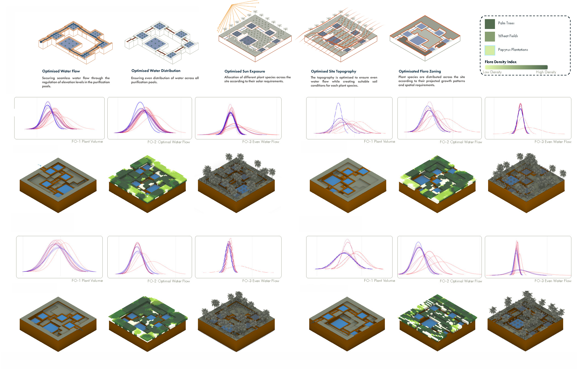 

*Variations for Subterranean Currents project using Rhino.Ecologic. Image © Sherine Elabd, Maria Aranzales, Orfeas Rachiotis, AA EmTech Programme.* 
 
 

#### 6.2.2 Use Case B: Post-Mining Palimpsest, Master of Science Dissertation at AA (EmTech])  

Authors: Mauli Patel (Msc), Sung-Soo Park (Msc), Ajinkya Randive (MArch), Luis Castro Aguilar (MArch)  

*"Rhino Ecologic was utilized as a computational simulation tool to quantify and visualize the potential ecological recovery of the degraded mining landscape over time. By integrating site-specific environmental data, such as terrain geometry, solar radiation, and inclination, with detailed biological profiles of native plant species (including growth rates, rooting depths, and canopy expansion), the plugin simulated the progressive accumulation of plant volume and biomass. These simulations, conducted at a 2x2 meter voxel resolution over projected intervals of 2, 5, 7, and 9 years, provided critical data-driven validation for the project's phytoremediation strategy, demonstrating how specific plant guilds would successfully establish themselves to improve soil conditions and generate organic matter within the stabilization corridor."*  

Link to dissertation: [https://issuu.com/aaemtech/docs/post-mining_palimpsest_msc_](https://issuu.com/aaemtech/docs/post-mining_palimpsest_msc_)

Link to AA EmTech: [https://emtech.aaschool.ac.uk/](https://emtech.aaschool.ac.uk/) 

 
  
*Post-Mining Palimpsest. Image © Mauli Patel, Sung-Soo Park, Ajinkya Randive, Luis Castro Aguilar, AA EmTech Programme.* 
 

 
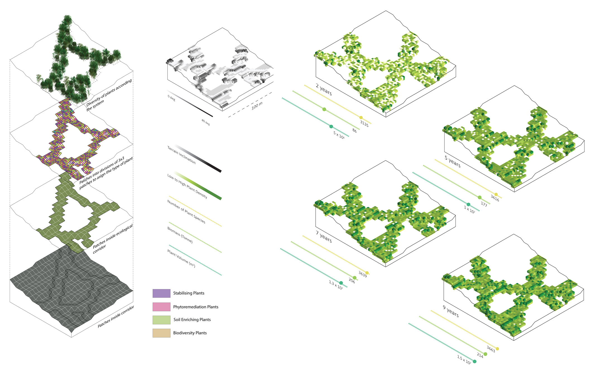 
   
*Variations for Post-Mining Palimpsest using Rhino.Ecologic. Image © Mauli Patel, Sung-Soo Park, Ajinkya Randive, Luis Castro Aguilar, AA EmTech Programme.* 
 
 

 
## Chapter 7: Interoperability with other software solutions 

Rhino.Ecologic is designed for interoperability within the Rhino and Grasshopper ecosystem, enabling structured data exchange and integration with external tools used in computational design, urban planning, landscape architecture, and BIM- and GIS-based workflows.
Because Rhino.Ecologic operates natively in Grasshopper, its environmental and ecological outputs can be directly coupled with optimization frameworks such as Wallacei and with parametric landscape BIM tools such as RhinoLands, which provides GIS-compatible attribute tables and structured spatial data models.
This allows ecological simulation results to inform optimization, parameter studies, and large-scale landscape modeling workflows in a consistent and data-driven manner. 

### 7.1 Coupling Rhino.Ecologic with Wallacei 

Wallacei is a multi-objective evolutionary optimization framework for Rhino and Grasshopper that enables designers to explore large parametric design spaces through genetic algorithms and Pareto-based solution ranking. When combined with Rhino.Ecologic, Wallacei transforms ecological simulation from an evaluative tool into an optimization driver within computational workflows. 

#### 7.1.1 Conceptual integration 

In a standard Rhino.Ecologic workflow, ecological performance indicators such as biomass, biodiversity (species abundance), soil performance, or solar exposure are computed for a given design state. These indicators can be extracted using components such as: `Get Biodiversity Summaries`,`Get Soil Summaries`, `Get Solar Summaries`, and `Get Voxel Summaries`.
These outputs can be directly connected to Wallacei as objective functions. Instead of manually adjusting geometry and rerunning simulations, Wallacei systematically varies parametric inputs, for instance building massing, terrace and roof `Geometry`, `Soil Depth` distribution, `Voxel Size`, `Biophilic Area` allocation, and `Plant Library` composition  

Each generated design iteration is evaluated through Rhino.Ecologic, and the resulting ecological metrics are passed to Wallacei as fitness criteria. This establishes a closed performance-driven loop: **Parametric Geometry → Ecological Simulation → Performance Metrics → Evolutionary Optimization**  

#### 7.1.2 Multi-Objective ecological optimization 

Ecological design problems are inherently multi-objective. Increasing biomass may reduce species diversity. Maximizing soil depth may conflict with structural constraints. Increasing solar exposure may alter understorey viability. 

Wallacei allows simultaneous optimization of competing objectives such as maximizing biodiversity (species richness or abundance), maximizing biomass accumulation, minimizing artificial soil volume, balancing solar exposure across voxel types, and maximizing the ratio of biophilic voxels.  

Rather than returning a single “best” solution, Wallacei generates a **Pareto front**—a set of non-dominated solutions representing different trade-offs between objectives. Designers can then select solutions based on project priorities rather than purely numerical ranking.  

#### 7.1.3 Technical data exchange 

The interoperability between Rhino.Ecologic and Wallacei operates entirely within Grasshopper’s data structure:

1. Rhino.Ecologic computes spatio-temporal ecological outputs.  
2. Summary statistics or filtered voxel metrics are extracted.  
3. These values are converted into scalar fitness inputs.  
4. Wallacei evaluates populations and evolves new parameter sets.  
5. Updated geometry is re-fed into Rhino.Ecologic for the next generation.   

Because Rhino.Ecologic produces structured, accessible data—not just visual output—it integrates seamlessly into evolutionary workflows without requiring custom scripting.  

#### 7.1.4 Use Cases 

Coupling Rhino.Ecologic with Wallacei enables the ptimization of green roof configurations for maximum biodiversity, massing studies balancing density and ecological performance, soil allocation strategies for urban courtyards, parametric façade greening systems, and performance-driven urban block design.  

In this setup, ecological simulation becomes an active generative constraint rather than a passive validation layer. 

'add image'
'add text'

> 💡 **Tip:** To repeat this exercise using your own setup, you can use the Tutorial template 🦗 Grasshopper files ***`xx`.gh***, and the 🦏 Rhino 3D model example file ***Rhino.Ecologic_Example_Wood_Cabins.3dm***, which are available by hovering over the **Rhino.Ecologic tab** at the top of the Grasshopper menu. 
 

#### 7.1.5 From evaluation to generative ecology 

The combination of Rhino.Ecologic and Wallacei represents a methodological shift. Instead of asking *“Does this design perform ecologically well?”* the workflow asks *“Which design configurations produce the most desirable ecological outcomes under defined constraints?”*
By embedding ecological simulation into evolutionary optimization, biodiversity and biomass become drivers of form generation within computational design systems rather than post-design metrics.  

### 7.2 Coupling Rhino.Ecologic with Rhino.Lands 

RhinoLands is a BIM tool for the parametric modeling of landscape and urban planning, in Rhino enviornment. It includes Grasshopper components for parametric design and structured representation, processing, and synthesis of landscape and territorial data. Within RhinoLands workflows, users can integrate spatio-temporal ecological data—including planting schemes generated with Rhino.Ecologic to instantiate 3D plant assets as information-rich BIM elements. 

#### 7.2.1 Conceptual integration 

While Rhino.Ecologic simulates plant community dynamics, biomass development, and biodiversity over time, RhinoLands provides structured landscape elements with embedded semantic information. This includes terrain layers, soil stratigraphy, planting zones, and landscape components enriched with attribute data.

The integration allows ecological simulation outputs—such as species distribution, biomass accumulation, or soil performance—to be mapped onto parametric landscape elements. In this way, ecological performance becomes part of the landscape information model rather than an isolated analytical layer. 

This creates a bidirectional workflow:
**Landscape Geometry → Ecological Simulation → Performance Data → Parametric Landscape Model**

Design changes in RhinoLands (e.g., modified terrain, soil depth adjustments, planting zones) can be fed back into Rhino.Ecologic for re-simulation, enabling iterative refinement of ecological outcomes.  

#### 7.2.2 Structured data and attribute exchange 

Both Rhino.Ecologic and RhinoLands operate within Grasshopper’s structured data environment. This shared infrastructure enables:

1. Transfer of terrain and soil geometries from RhinoLands into Rhino.Ecologic.
2. Simulation of ecological dynamics within the defined spatial domain.
3. Extraction of ecological performance metrics per voxel or zone.
4. Mapping of results back to RhinoLands attribute tables.

Because RhinoLands supports GIS-compatible attribute structures, ecological outputs can be organized, classified, and exported in formats suitable for planning documentation, BIM coordination, or further GIS analysis.

This structured exchange ensures that ecological simulation data remains embedded within spatially explicit landscape models.  

#### 7.2.3 Applications in landscape and urban projects 

The coupling of Rhino.Ecologic and RhinoLands enables the evaluation of soil layer configurations in relation to biodiversity outcomes, parametric testing of planting strategies across terrain variations, biomass estimation across large landscape developments, scenario comparison for biodiversity-sensitive urban districts, and the integration of ecological metrics into BIM-based landscape documentation.  

By linking dynamic ecological simulation with structured landscape modeling, designers can move from abstract sustainability targets toward quantifiable, spatially embedded ecological performance.  

#### 7.2.4 From simulation to landscape information modeling (LIM) 

The integration of Rhino.Ecologic with RhinoLands extends ecological modeling into the realm of landscape information modeling (LIM). Instead of treating vegetation performance as a separate analysis step, ecological intelligence becomes embedded within the parametric landscape model itself.

This approach supports long-term, data-informed landscape planning in which geometry, soil configuration, planting strategy, and ecological dynamics are evaluated as interconnected systems rather than isolated components. 

 

*Planting Strategy from Rhino.Ecologic visualized in RhinoLands.* 
  

> 💡 **Tip:** To repeat this exercise using your own setup, you can use the Tutorial template 🦗 Grasshopper files ***`xx`.gh***, and the 🦏 Rhino 3D model example file ***Rhino.Ecologic_Example_Wood_Cabins.3dm***, which are available by hovering over the **Rhino.Ecologic tab** at the top of the Grasshopper menu. 
 
 
 

------

 
### Glossary 

This glossary defines key terms used in Rhino.Ecologic workflows. 

| Name | Description |
|------|-------------|
| **Agent-based model (ABM)** | *A modeling approach in which individual entities (agents) operate as autonomous objects in a 3D environment, following defined rules and reacting to local conditions. Used to simulate dynamic behavior, interactions, and emergent spatial patterns over time.* |
| **Attribute table** | *A table that stores non-geometric information (attributes) linked to spatial objects, enabling data-driven analysis and filtering.* |
| **Data Tree (Grasshopper)** | *Grasshopper’s hierarchical data structure used to organize, relate, and process complex parametric datasets.* |
| **Ecological performance indicator** | *A quantitative metric used to evaluate ecological aspects such as habitat quality, biodiversity potential, or microclimatic performance.* |
| **Generative design** | *A workflow in which multiple design options are automatically generated and evaluated based on defined parameters, rules, and performance goals.* |
| **Multi-objective optimization** | *An optimization process that evaluates multiple, often competing performance criteria simultaneously and identifies optimal trade-off solutions rather than a single best result.* |
| **Parametric design** | *A design approach where geometry and relationships are controlled by parameters and rules, allowing rapid variation, evaluation, and iteration.* |
| **Performance-driven design** | *A design methodology where decisions are guided by measurable performance criteria instead of purely geometric or aesthetic considerations.* |
| **Plant traits** | *Key plant characteristics—such as size, growth rate, phenology, or environmental tolerance—used to describe and simulate plant behavior and performance.* |
| **Raster data** | *Spatial data stored as a regular grid of cells, commonly used for environmental, climatic, or terrain-related information.* |
| **Rule-based modeling** | *A modeling method in which geometry, behavior, or distribution is generated using explicit logical or mathematical rules.* |
| **Simulation coupling** | *The integration of multiple simulation or analysis processes within a single workflow to exchange data and evaluate combined effects.* |
| **Species** | *A group of genetically similar (populations of) individuals. In Rhino.Ecologic, a species is a group of plants that share the same plant traits (i.e., can also represent distinct populations or groups of plant species).* |
| **Spatio-temporal data** | *Data that includes both spatial information and time-based change, enabling analysis of how conditions evolve across space and time.* |
| **Successional dynamics** | *The modeled change of vegetation or ecological systems over time, reflecting growth, competition, and replacement processes.* |
| **Vector data** | *Spatial data represented by points, lines, and polygons with associated attributes, commonly used for boundaries, networks, and discrete features.* |
| **Voxel** | *A volumetric grid cell representing a value or set of attributes in 3D space, used for volumetric analysis and simulation.* |
| **Voxelization** | *The conversion of geometry or space into a voxel grid to enable volumetric analysis or simulation.* |

### References

<small> 

**CDFAM. (2026).** Ecological simulation framework for Rhino/Grasshopper: Interview with Verena Vogler of McNeel Europe.[ Read article](https://cdfam.com/ecological-simulation-framework-for-rhino-grasshopper3d/)

**Vogler, V., Kourkopoulos, E., Fraguada, L., Mimet, A., Joschinski, J. (2025).** Integrating Ecological Modeling into the 3D CAD System Rhinoceros. *JoDLA Journal of Digital Landscape Architecture*, Issue 10-2025, 86–100. Berlin/Offenbach: Wichmann Verlag im VDE VERLAG. e-ISSN 2511-624X, https://doi.org/10.14627/537754009.

**Vogler, V., Kourkopoulos, E., Joschinski, J., Eckelt, K. (2025).** Developing Volumetric Data Models for ML Training Datasets Using Grasshopper. *JoDLA Journal of Digital Landscape Architecture*, Issue 10-2025, 101–113. Berlin/Offenbach: Wichmann Verlag im VDE VERLAG. e-ISSN 2511-624X, https://doi.org/10.14627/537754010. 

**Biselli, L. (2025).** Report 4. Shape to Fabrication 2025. https://shapetofabrication.com/shape-to-fabrication-conference-reports-2025/

**Joschinski J., Boulangeat I., Calbi M., Hauck T.E, Vogler V., Mimet A. (2024).** The Ecolopes Plant Model: a high-resolution model to simulate plant community dynamics in cities and other human-dominated and managed environments. *bioRxiv* 2024.09.23.614561. </small>

 ### Acknowledgements
 
Development of Rhino.Ecologic has been supported by McNeel Europe and Robert McNeel & Associates. Early conceptual research informing aspects of this work was supported by the European Commission under Horizon 2020 (Grant Agreement No. 964414).

 
 &copy; 2026 McNeel Europe S.L. All rights reserved.
